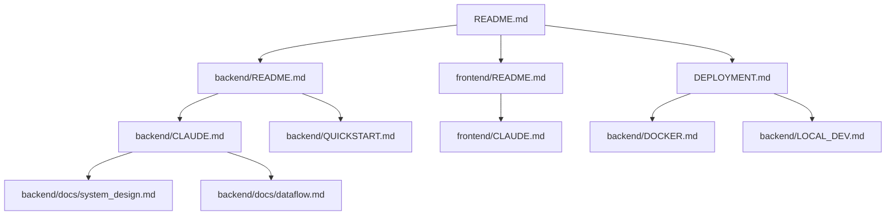

# Documentation Index

Complete guide to all Tiny Researcher documentation.

## Quick Start

**New to Tiny Researcher?** Start here:

1. **[README.md](README.md)** - Project overview, quick start, features
2. **[DEPLOYMENT.md](DEPLOYMENT.md)** - Docker deployment guide
3. **[Backend README](backend/README.md)** - Backend quick reference
4. **[Frontend README](frontend/README.md)** - Frontend quick reference

## Documentation by Role

### For Users

- **[README.md](README.md)** - Main project documentation
  - Features overview
  - Quick start with Docker
  - Environment configuration
  - API endpoints reference
  - Troubleshooting

### For Developers

#### Backend Development

- **[backend/README.md](backend/README.md)** - Backend overview
- **[backend/CLAUDE.md](backend/CLAUDE.md)** - Comprehensive development guide (504 lines)
  - Project structure
  - 10-phase pipeline details
  - Architecture patterns
  - Code examples
- **[backend/QUICKSTART.md](backend/QUICKSTART.md)** - Getting started
  - Docker setup
  - Manual installation
  - Running tests
  - Example workflows

#### Frontend Development

- **[frontend/README.md](frontend/README.md)** - Frontend overview
  - Pages and routing
  - Components library
  - Services and hooks
  - Styling guide
- **[frontend/CLAUDE.md](frontend/CLAUDE.md)** - Frontend development guide
  - Project structure
  - Backend integration
  - Development patterns
  - Limitations

#### Architecture & Design

- **[backend/docs/system_design.md](backend/docs/system_design.md)** - System architecture
  - Technology stack
  - Architecture diagrams
  - Key components
  - MongoDB/Redis schemas
- **[backend/docs/dataflow.md](backend/docs/dataflow.md)** - Data flow diagrams
  - Citation-first pipeline flow
  - Data layer architecture
  - Key data structures
- **[backend/docs/business_logic.md](backend/docs/business_logic.md)** - Business rules
  - Use cases
  - Core business rules
  - Workflow scheduling
- **[backend/docs/erd.md](backend/docs/erd.md)** - Database schema
  - Entity-relationship diagram
  - Table descriptions
  - Indexes and constraints

### For DevOps

- **[DEPLOYMENT.md](DEPLOYMENT.md)** - Production deployment guide
  - Prerequisites
  - Docker deployment
  - Security checklist
  - SSL/TLS setup
  - Monitoring
  - Backup & recovery
- **[backend/DOCKER.md](backend/DOCKER.md)** - Docker guide
  - One-command startup
  - Production deployment
  - Data persistence
- **[backend/LOCAL_DEV.md](backend/LOCAL_DEV.md)** - Local development
  - Development workflow
  - Makefile commands
  - Debugging
- **[backend/TEST_FROM_SCRATCH.md](backend/TEST_FROM_SCRATCH.md)** - Testing scenarios
  - Clean state testing
  - Verification checklist

### For AI Assistants

- **[CLAUDE.md](CLAUDE.md)** - Monorepo overview
- **[backend/CLAUDE.md](backend/CLAUDE.md)** - Backend guide
- **[frontend/CLAUDE.md](frontend/CLAUDE.md)** - Frontend guide

## Documentation Structure

```
tiny_researcher/
├── README.md                          # Main documentation
├── DEPLOYMENT.md                      # Production deployment
├── CLAUDE.md                          # Monorepo guide
├── backend/
│   ├── README.md                     # Backend quick reference
│   ├── CLAUDE.md                     # Backend development guide
│   ├── QUICKSTART.md                 # Getting started
│   ├── DOCKER.md                     # Docker guide
│   ├── LOCAL_DEV.md                  # Local development
│   ├── TEST_FROM_SCRATCH.md          # Testing guide
│   └── docs/
│       ├── system_design.md          # Architecture
│       ├── dataflow.md               # Data flow
│       ├── business_logic.md         # Business rules
│       └── erd.md                    # Database schema
└── frontend/
    ├── README.md                     # Frontend quick reference
    └── CLAUDE.md                     # Frontend development guide
```

## Key Topics

### Authentication

- JWT-based authentication: [backend/CLAUDE.md](backend/CLAUDE.md#authentication)
- Auth service implementation: [backend/README.md](backend/README.md#using-authentication)
- Frontend auth flow: [frontend/README.md](frontend/README.md#useauth)

### Research Pipeline

- 10-phase workflow: [backend/CLAUDE.md](backend/CLAUDE.md#research-pipeline)
- Pipeline architecture: [backend/docs/dataflow.md](backend/docs/dataflow.md)
- Phase details: [backend/docs/system_design.md](backend/docs/system_design.md)

### API Reference

- All endpoints: [README.md](README.md#api-endpoints)
- Backend routes: [backend/README.md](backend/README.md#api-endpoints-42-total)
- Request/response examples: [backend/CLAUDE.md](backend/CLAUDE.md#code-examples)

### Database

- Schema overview: [backend/README.md](backend/README.md#database-schema)
- Collections: [backend/docs/system_design.md](backend/docs/system_design.md)
- ERD: [backend/docs/erd.md](backend/docs/erd.md)

### Deployment

- Docker setup: [README.md](README.md#quick-start)
- Production config: [DEPLOYMENT.md](DEPLOYMENT.md)
- Security: [DEPLOYMENT.md](DEPLOYMENT.md#security-checklist)
- Monitoring: [DEPLOYMENT.md](DEPLOYMENT.md#monitoring)

### Development

- Backend setup: [backend/QUICKSTART.md](backend/QUICKSTART.md)
- Frontend setup: [frontend/README.md](frontend/README.md#quick-start)
- Local workflow: [backend/LOCAL_DEV.md](backend/LOCAL_DEV.md)

## Documentation Standards

All documentation follows these standards:

1. **Markdown format** with GitHub flavoring
2. **Code examples** with syntax highlighting
3. **Table of contents** for long documents
4. **Clear headings** using semantic hierarchy
5. **Practical examples** over theory
6. **Up-to-date** with current implementation

## Contributing to Docs

When updating documentation:

1. Keep examples practical and tested
2. Update all related docs when changing features
3. Use consistent terminology across docs
4. Add code examples for new features
5. Update this index when adding new docs

## Getting Help

1. **Start with README.md** for general overview
2. **Check DEPLOYMENT.md** for production issues
3. **Read relevant CLAUDE.md** for development questions
4. **Review docs/** for architecture details
5. **Open GitHub issue** if documentation is unclear

## Document Relationships



## Last Updated

This documentation index was last updated: 2026-02-10

## Feedback

Found an issue with the documentation? Please:
1. Check if the information is in a different document
2. Review the relevant CLAUDE.md file
3. Open a GitHub issue with details
4. Tag it with `documentation` label
