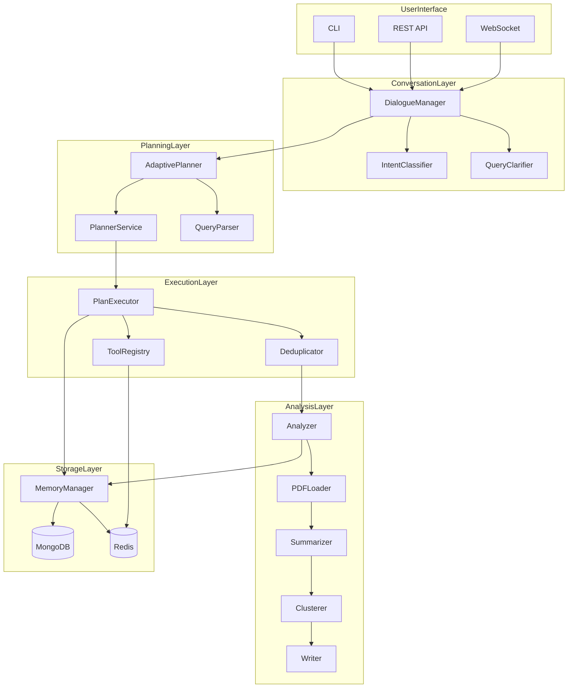

# Research Assistant Backend - Codebase Knowledge Document

> **Version**: 3.4  
> **Generated**: 2026-02-09  
> **Purpose**: Comprehensive technical documentation for AI-powered research paper aggregation system

---

## Table of Contents

1. [High-Level Overview](#high-level-overview)
2. [System Architecture](#system-architecture)
3. [Feature Analysis](#feature-analysis)
4. [Technical Reference](#technical-reference)
5. [Gotchas & Nuances](#gotchas--nuances)
6. [Glossary](#glossary)

---

## High-Level Overview

### Application Purpose

**Research Assistant Backend** is an AI-powered academic research paper aggregation and analysis system that:

1. **Collects** papers from multiple sources (ArXiv, HuggingFace, custom URLs)
2. **Analyzes** relevance using LLM-based scoring
3. **Clusters** papers by semantic themes
4. **Synthesizes** comprehensive Markdown research reports

### Target Users

- Academic researchers tracking new publications
- R&D teams monitoring specific research domains
- AI practitioners exploring state-of-the-art methods

### Business Goals

| Goal | Feature | Business Value |
|------|---------|----------------|
| Time Savings | Automated paper collection | Reduce manual search from hours to minutes |
| Quality Filtering | LLM relevance scoring | Focus only on high-value papers (score ≥ 7) |
| Knowledge Organization | Semantic clustering | Discover research directions automatically |
| Report Generation | Markdown synthesis | Ready-to-share research summaries |

---

## System Architecture

### Technology Stack

```
┌─────────────────────────────────────────────────────────────────┐
│                      Interface Layer                             │
│  CLI (Rich/Typer) │ REST API (FastAPI) │ WebSocket (Streaming)  │
└─────────────────────────────────────────────────────────────────┘
                               │
┌─────────────────────────────────────────────────────────────────┐
│                    Conversation Layer                            │
│    DialogueManager │ IntentClassifier │ QueryClarifier           │
│    State: IDLE → CLARIFYING → PLANNING → REVIEWING → EXECUTING  │
└─────────────────────────────────────────────────────────────────┘
                               │
┌─────────────────────────────────────────────────────────────────┐
│                      Core Pipeline                               │
│  AdaptivePlanner │ PlanExecutor │ ToolRegistry │ Deduplicator   │
└─────────────────────────────────────────────────────────────────┘
                               │
┌─────────────────────────────────────────────────────────────────┐
│                    Analysis Pipeline                             │
│  AnalyzerService → PDFLoader → Summarizer → Clusterer → Writer  │
└─────────────────────────────────────────────────────────────────┘
                               │
┌─────────────────────────────────────────────────────────────────┐
│                     Storage Layer                                │
│  MongoDB (Cold) │ Redis (Warm) │ In-Memory (Hot) │ Qdrant       │
└─────────────────────────────────────────────────────────────────┘
```

### Dependencies

| Category | Package | Version | Purpose |
|----------|---------|---------|---------|
| API Framework | fastapi | ≥0.109.0 | REST API |
| Database | motor | ≥3.3.2 | MongoDB async driver |
| Cache | redis | ≥5.0.1 | Session/tool caching |
| LLM (Google) | google-genai | ≥0.2.0 | Gemini API |
| LLM (OpenAI) | openai | ≥1.10.0 | GPT API |
| ML/NLP | sentence-transformers | ≥2.3.1 | Embeddings |
| Clustering | scikit-learn | ≥1.4.0 | HDBSCAN/KMeans |
| PDF | pypdf | ≥4.0.0 | PDF text extraction |
| CLI | rich, typer | ≥13.7.0 | Interactive terminal |
| Vector Store | qdrant-client | ≥1.7.0 | Semantic search |

---

## Directory Structure

```
research_assistant/backend/
├── src/
│   ├── core/                    # Core infrastructure
│   │   ├── config.py           # Settings (MongoDB, Redis URLs)
│   │   ├── database.py         # MongoDB connection manager
│   │   ├── models.py           # Pydantic models (Paper, Cluster, Report)
│   │   ├── schema.py           # API schemas (ResearchRequest, ResearchPlan)
│   │   ├── prompts.py          # LLM prompt templates
│   │   └── memory_manager.py   # Session memory (Hot/Warm/Cold layers)
│   │
│   ├── adapters/                # External integrations
│   │   └── llm.py              # LLM adapters (Gemini, OpenAI)
│   │
│   ├── tools/                   # Tool system
│   │   ├── registry.py         # Tool registration (decorator pattern)
│   │   ├── schema.py           # Tool parameter schemas
│   │   ├── cache_manager.py    # Redis-based tool caching
│   │   └── builtin/            # Built-in tools
│   │       ├── arxiv.py        # arxiv_search, arxiv_search_keywords
│   │       ├── huggingface.py  # hf_trending
│   │       └── collector.py    # collect_url
│   │
│   ├── planner/                 # Research planning
│   │   ├── service.py          # PlannerService - plan generation
│   │   ├── executor.py         # PlanExecutor - step execution
│   │   ├── adaptive_planner.py # AdaptivePlannerService (QUICK/FULL)
│   │   ├── query_parser.py     # QueryParser - intent detection
│   │   └── store.py            # Plan persistence
│   │
│   ├── conversation/            # Conversational interface
│   │   ├── context.py          # ConversationContext, DialogueState
│   │   ├── intent.py           # IntentClassifier
│   │   ├── clarifier.py        # QueryClarifier ("Think Before Plan")
│   │   └── dialogue.py         # DialogueManager (state machine)
│   │
│   ├── research/                # Research workflow
│   │   ├── pipeline.py         # ResearchPipeline orchestrator
│   │   ├── analysis/
│   │   │   ├── analyzer.py     # AnalyzerService - relevance scoring
│   │   │   ├── pdf_loader.py   # PDFLoaderService - selective loading
│   │   │   ├── summarizer.py   # SummarizerService
│   │   │   └── clusterer.py    # ClustererService
│   │   ├── ingestion/
│   │   │   └── searcher.py     # ArxivSearcher
│   │   └── synthesis/
│   │       └── writer.py       # WriterService - report generation
│   │
│   ├── storage/                 # Data persistence
│   │   ├── repositories.py     # MongoDB repositories
│   │   └── vector_store.py     # Vector embeddings (Qdrant)
│   │
│   ├── api/                     # FastAPI endpoints
│   │   ├── main.py             # App configuration
│   │   └── routes/
│   │       ├── conversation.py # Conversation CRUD + SSE
│   │       ├── planner.py      # Plan management
│   │       └── websocket.py    # Real-time bidirectional
│   │
│   ├── cli/                     # Command-line interface
│   │   └── ...                 # ResearchCLI with streaming
│   │
│   └── memory/                  # Memory management
│       └── ...                 # MemoryManager, MemoryContext
│
├── scripts/                     # Test scripts
│   ├── test_phase_1_2.py       # Full pipeline test
│   ├── test_phase_3.py         # Adaptive planning test
│   └── test_phase_4.py         # Conversational interface test
│
├── docs/                        # Documentation
│   ├── system_design.md        # Architecture overview
│   ├── dataflow.md             # Pipeline flow diagrams
│   └── business_logic.md       # Use cases, business rules
│
├── requirements.txt             # Python dependencies
├── CLAUDE.md                    # AI assistant guide
└── QUICKSTART.md               # Getting started
```

---

## Feature Analysis

### Feature 1: 8-Phase Research Pipeline

**Purpose**: Orchestrate complete research workflow from topic to report

**Business Need**: Automate the entire research paper discovery and synthesis process

**Entry Point**: `src/research/pipeline.py` → `ResearchPipeline`


| Phase | Service | Action | Output |
|-------|---------|--------|--------|
| 1. Planning | `PlannerService` | Generate research plan from topic | `ResearchPlan` |
| 2. Execution | `PlanExecutor` | Execute tools, collect papers | `List[Paper]` (raw) |
| 3. Persistence | `PaperRepository` | Save to MongoDB | Papers in DB |
| 4. Analysis | `AnalyzerService` | Score relevance (0-10) | Scored papers |
| 5. PDF Loading | `PDFLoaderService` | Load full text for score ≥ 8 | Papers with full_text |
| 6. Summarization | `SummarizerService` | Extract problem/method/result | `PaperSummary` |
| 7. Clustering | `ClustererService` | Group by theme | `List[Cluster]` |
| 8. Writing | `WriterService` | Generate Markdown report | Report string |

**Usage**:
```python
from src.research.pipeline import ResearchPipeline
from src.core.schema import ResearchRequest

pipeline = ResearchPipeline(llm_client, use_adaptive_planner=True)

# Two-step with review
plan = await pipeline.generate_adaptive_plan(request)
# Human reviews/edits plan
result = await pipeline.execute_plan(request, adaptive_plan=plan)

# Or one-shot
result = await pipeline.run(ResearchRequest(topic="transformer models"))
```

---

### Feature 2: Adaptive Planning (QUICK vs FULL)

**Purpose**: Automatically select pipeline depth based on query complexity

**Business Need**: Fast answers for simple queries, comprehensive analysis for research

**Entry Point**: `src/planner/adaptive_planner.py` → `AdaptivePlannerService`

| Mode | Phases | Use Case | Duration |
|------|--------|----------|----------|
| `QUICK` | 4 phases (no synthesis) | Quick search, simple questions | 15-30s |
| `FULL` | 8 phases (complete) | Deep research, report generation | 45-90s |

**Decision Logic** (in `QueryParser`):
- Keywords like "quick", "fast", "just find" → `QUICK`
- Keywords like "comprehensive", "deep dive", "analyze" → `FULL`
- Default: `FULL`

---

### Feature 3: Conversational Interface

**Purpose**: Human-in-the-loop research with dialogue flow

**Business Need**: Allow users to refine queries, review plans, and control execution

**Entry Point**: `src/conversation/dialogue.py` → `DialogueManager`

**State Machine**:
```
IDLE → CLARIFYING → PLANNING → REVIEWING → EXECUTING → COMPLETE
        ↑                           ↓
        └───────────────────────────┘ (reject/edit)
```

**Intent Classification**:
| Intent | Trigger Words | Action |
|--------|---------------|--------|
| `new_research` | "research X", "find papers" | Start clarification |
| `approve` | "yes", "ok", "proceed" | Execute plan |
| `reject` | "no", "cancel", "stop" | Return to IDLE |
| `edit` | "change X to Y", "add keyword" | Modify plan |
| `ask` | "explain", "what is" | Q&A mode |

---

### Feature 4: Tool System

**Purpose**: Extensible paper collection from multiple sources

**Business Need**: Support various academic sources (ArXiv, HuggingFace, URLs)

**Entry Point**: `src/tools/registry.py`

**Built-in Tools**:

| Tool | Location | Description |
|------|----------|-------------|
| `arxiv_search` | `tools/builtin/arxiv.py` | Search ArXiv by query |
| `arxiv_search_keywords` | `tools/builtin/arxiv.py` | Multi-keyword OR search |
| `hf_trending` | `tools/builtin/huggingface.py` | Scrape HuggingFace papers |
| `collect_url` | `tools/builtin/collector.py` | Extract paper from URL |

**Registration Pattern**:
```python
@register_tool(
    name="arxiv_search",
    description="Search academic papers on ArXiv",
    tags=["search", "ingestion"]
)
async def arxiv_search(query: str, max_results: int = 20) -> List[dict]:
    ...
```

**Caching** (in `ToolCacheManager`):
- ArXiv results: 1 hour TTL
- HuggingFace: 30 min TTL
- URL collection: 24 hour TTL
- Cache key: `tool_cache:{tool_name}:{md5(args)}`

---

### Feature 5: Multi-Layer Memory

**Purpose**: Efficient session state management with fallback

**Business Need**: Resume interrupted research, cache expensive operations

**Entry Point**: `src/core/memory_manager.py` → `ResearchMemoryManager`

```
┌─────────────────────────────────────────┐
│          HOT (In-Process)               │
│  - Current session state                │
│  - Paper registry (fast lookup)         │
│  - Access time: microseconds            │
└─────────────────────────────────────────┘
                    ↓ spill
┌─────────────────────────────────────────┐
│          WARM (Redis)                   │
│  - Session checkpoints (24h TTL)        │
│  - Tool cache (1-24h TTL)               │
│  - PDF cache (7 day TTL)                │
│  - Access time: milliseconds            │
└─────────────────────────────────────────┘
                    ↓ persist
┌─────────────────────────────────────────┐
│          COLD (MongoDB)                 │
│  - Papers (permanent)                   │
│  - Clusters, Reports                    │
│  - Access time: 10s of ms               │
└─────────────────────────────────────────┘
```

**Checkpoint/Resume**:
```python
# Save checkpoint
await memory.checkpoint(session_id, "analysis")

# Resume from checkpoint
session = await memory.restore_from_checkpoint(session_id, "analysis")
```

---

### Feature 6: LLM Integration

**Purpose**: Unified interface for multiple LLM providers

**Business Need**: Flexibility to switch between Gemini and OpenAI

**Entry Point**: `src/adapters/llm.py`

**Providers**:
| Provider | Adapter | Default Model | Streaming |
|----------|---------|---------------|-----------|
| Google Gemini | `GeminiAdapter` | gemini-2.0-flash | ✅ |
| OpenAI | `OpenAIAdapter` | gpt-4o-mini | ✅ |

**Interface**:
```python
class LLMClientInterface(ABC):
    async def generate(prompt, system_instruction, json_mode) -> str
    async def generate_stream(prompt, system_instruction) -> AsyncIterator[str]
```

**Factory Usage**:
```python
from src.adapters.llm import LLMFactory

llm = LLMFactory.create_client("gemini")  # Uses GEMINI_API_KEY
llm = LLMFactory.create_client("openai")  # Uses OPENAI_API_KEY
```

---

### Feature 7: REST API + WebSocket

**Purpose**: HTTP and real-time interfaces for external clients

**Business Need**: Frontend integration, async progress updates

**Entry Point**: `src/api/main.py`, `src/api/routes/`

**Endpoints**:

| Method | Path | Description |
|--------|------|-------------|
| POST | `/api/v1/conversations` | Start new conversation |
| GET | `/api/v1/conversations/{id}` | Get state |
| POST | `/api/v1/conversations/{id}/messages` | Send message |
| GET | `/api/v1/conversations/{id}/stream` | SSE progress |
| DELETE | `/api/v1/conversations/{id}` | Delete |
| WS | `/api/v1/ws/{conversation_id}` | WebSocket |

**SSE Events**:
- `progress`: Pipeline phase updates
- `state_change`: Dialogue transitions
- `message`: New assistant messages
- `complete`: Research finished
- `error`: Error occurred

---

## Technical Reference

### Core Data Models

#### Paper (`src/core/models.py`)

```python
class Paper(BaseModel):
    id: Optional[str]           # MongoDB _id
    arxiv_id: Optional[str]     # ArXiv identifier
    doi: Optional[str]          # Digital Object Identifier
    title: str                  # Paper title
    abstract: str               # Paper abstract
    authors: List[str]          # Author names
    published_date: datetime    # Publication date
    source: str                 # "arxiv" | "huggingface" | "url"
    url: Optional[str]          # Original URL
    pdf_url: Optional[str]      # PDF download link
    full_text: Optional[str]    # Full PDF content (if loaded)
    status: PaperStatus         # RAW | SCORED | SUMMARIZED | INDEXED
    relevance_score: float      # 0.0 - 10.0
    summary: PaperSummary       # problem/approach/results
    cluster_id: Optional[str]   # Assigned cluster
    plan_id: Optional[str]      # Research plan that collected this
```

#### ResearchRequest (`src/core/schema.py`)

```python
class ResearchRequest(BaseModel):
    topic: str                  # REQUIRED: Main research topic
    time_window: TimeWindow     # Optional date range filter
    keywords: List[str]         # Seed keywords (agent expands)
    sources: List[str]          # Specific URLs to crawl
    research_questions: List[str]  # Specific questions to answer
    output_config: OutputConfig # max_papers, language, format
```

#### ResearchPlan (`src/core/schema.py`)

```python
class ResearchPlan(BaseModel):
    topic: str                  # Original topic
    summary: str                # Plan description
    steps: List[ResearchStep]   # Ordered execution steps
    language: str               # Output language

class ResearchStep(BaseModel):
    id: int                     # Step number (1-indexed)
    action: str                 # "research" | "analyze" | "synthesize"
    title: str                  # Human-readable title
    description: str            # What this step does
    queries: List[str]          # Search queries
    sources: List[str]          # Specific sources
    tool: Optional[str]         # Tool name from registry
    tool_args: dict             # Tool arguments
    completed: bool             # Execution status
```

---

### Database Schema (MongoDB)

**Collections**:

| Collection | Description | Key Fields |
|------------|-------------|------------|
| `papers` | Research papers | arxiv_id, title, abstract, relevance_score, summary |
| `clusters` | Paper groupings | name, description, paper_ids, plan_id |
| `reports` | Generated reports | content, plan_id, paper_count |
| `plans` | Research plans | topic, steps, status |

**Redis Keys**:

| Pattern | TTL | Purpose |
|---------|-----|---------|
| `tool_cache:{tool}:{md5}` | 1-24h | Tool result cache |
| `pdf_cache:{url}` | 7 days | PDF content cache |
| `session:{id}` | 24h | Session state |
| `checkpoint:{session}:{phase}` | 24h | Phase checkpoints |

---

### Key Algorithms

#### Paper Deduplication (`PaperDeduplicator`)

Multi-level strategy:
1. **ArXiv ID**: Exact match on `arxiv_id`
2. **Fingerprint**: SHA256 of normalized `title + first_author`
3. **Title Similarity**: Levenshtein ratio ≥ 0.85

```python
def is_duplicate(paper: dict) -> bool:
    # Level 1: ArXiv ID
    if paper.arxiv_id in seen_arxiv_ids:
        return True
    
    # Level 2: Fingerprint
    fp = sha256(normalize(title + author))
    if fp in seen_fingerprints:
        return True
    
    # Level 3: Fuzzy title match
    for seen_title in seen_titles:
        if fuzz.ratio(title, seen_title) >= 0.85:
            return True
    
    return False
```

#### Relevance Scoring (`AnalyzerService`)

LLM-based batch evaluation:
```python
RELEVANCE_THRESHOLD = 7.0

async def analyze_batch(papers, topic):
    prompt = f"""
    Topic: {topic}
    
    For each paper, rate relevance 0-10:
    {[p.title + ": " + p.abstract[:200] for p in papers]}
    
    Return JSON: {{"scores": [{{id, score, reasoning}}, ...]}}
    """
    response = await llm.generate(prompt, json_mode=True)
    return parse_scores(response)
```

#### Selective PDF Loading

Only load full text for high-value papers:
```python
THRESHOLD = 8.0

async def load_full_text(paper):
    if paper.relevance_score < THRESHOLD:
        return False  # Skip - use abstract only
    
    if cached := await redis.get(f"pdf_cache:{paper.pdf_url}"):
        paper.full_text = cached
        return True
    
    text = await download_and_parse_pdf(paper.pdf_url)
    await redis.setex(f"pdf_cache:{paper.pdf_url}", 7*86400, text)
    paper.full_text = text
    return True
```

---

## Gotchas & Nuances

### 1. HuggingFace Scraper Fragility

**Issue**: HuggingFace UI changes frequently break CSS selectors

**Location**: `src/tools/builtin/huggingface.py`

**Mitigation**: 
- Check selector validity when errors occur
- Fallback to ArXiv-only mode
- Log warnings for manual intervention

### 2. LLM JSON Parsing

**Issue**: LLMs sometimes return malformed JSON or wrap in markdown

**Location**: `src/research/analysis/analyzer.py:_parse_json_response`

**Solution**:
```python
def _parse_json_response(text):
    # Try direct parse
    try:
        return json.loads(text)
    except:
        pass
    
    # Extract from markdown code block
    match = re.search(r'```(?:json)?\s*([\s\S]*?)\s*```', text)
    if match:
        return json.loads(match.group(1))
    
    # Final fallback
    return None
```

### 3. PDF Loading Performance

**Issue**: Loading all PDFs is expensive (bandwidth, time, tokens)

**Design Decision**: Only load PDFs for papers with `relevance_score >= 8.0`

**Impact**: ~80% bandwidth savings, but some relevant papers only have abstract summaries

**Configuration**: `PDFLoaderService.relevance_threshold = 8.0`

### 4. Async Context Management

**Issue**: Must properly initialize async connections before use

**Pattern**:
```python
# Always do this before using services
await connect_mongodb()
cache = await get_cache_manager()
await memory.connect()
```

### 5. Tool Argument Flexibility

**Issue**: LLMs may pass `query` instead of `keywords` to `arxiv_search_keywords`

**Solution**: Accept both parameters:
```python
async def arxiv_search_keywords(
    keywords: List[str] = None,
    query: str = None,  # LLM often uses this
    ...
):
    if query and not keywords:
        keywords = query.split(" OR ")
```

### 6. No Authentication (Development Only)

**Current State**: API has no authentication

**Production Requirement**: Implement JWT/API key auth before deployment

### 7. Single Instance Limitation

**Current State**: No distributed processing

**Future**: Use Celery for parallel execution, Redis Cluster for distributed cache

---

## Glossary

| Term | Definition |
|------|------------|
| **Adaptive Plan** | Research plan with dynamically selected phases (QUICK/FULL) |
| **Checkpoint** | Redis-stored snapshot of session state at phase boundary |
| **Cluster** | Group of semantically related papers |
| **Cold Layer** | MongoDB - permanent storage |
| **Dialogue State** | Current conversation phase (IDLE, CLARIFYING, etc.) |
| **Hot Layer** | In-process Python dicts - fast temporary storage |
| **Intent** | Classified user message type (approve, reject, edit, etc.) |
| **Phase** | Single step in 8-phase pipeline |
| **Pipeline** | Complete research workflow orchestrator |
| **Relevance Score** | LLM-generated 0-10 rating of paper-to-topic match |
| **Research Plan** | Ordered list of steps to execute for research |
| **Research Step** | Single action in a plan (search, analyze, etc.) |
| **Session** | Active research workflow instance with state |
| **Tool** | Registered function for paper collection |
| **Warm Layer** | Redis - session cache with TTL |

---

## Configuration Reference

### Environment Variables

```bash
# MongoDB
MONGO_URL=mongodb://localhost:27017
MONGO_DB_NAME=research_assistant

# Redis
REDIS_URL=redis://localhost:6379/0

# LLM Providers
GEMINI_API_KEY=your_gemini_key
OPENAI_API_KEY=your_openai_key
```

### Cache TTLs

| Cache Type | TTL | Location |
|------------|-----|----------|
| ArXiv search | 1 hour | `cache_manager.py` |
| HuggingFace trending | 30 min | `cache_manager.py` |
| URL collection | 24 hours | `cache_manager.py` |
| PDF content | 7 days | `pdf_loader.py` |
| Session data | 24 hours | `memory_manager.py` |

### Thresholds

| Threshold | Value | Purpose |
|-----------|-------|---------|
| Relevance for DB | 7.0 | Minimum score to save paper |
| Relevance for PDF | 8.0 | Minimum score to load full text |
| Title similarity | 0.85 | Deduplication fuzzy match |
| Min cluster size | 3 | Minimum papers per cluster |

---

## Quick Commands

```bash
# Start services
docker run -d -p 27017:27017 --name mongo mongo:7
docker run -d -p 6379:6379 --name redis redis:7

# Install dependencies
pip install -r requirements.txt

# Run full pipeline test
python scripts/test_phase_1_2.py

# Run adaptive planning test
python scripts/test_phase_3.py

# Run conversational interface test
python scripts/test_phase_4.py

# Start API server
uvicorn src.api.main:app --reload
```

---

## Cross-Feature Interaction Map



---

*Document generated from codebase analysis. For updates, regenerate from source.*
