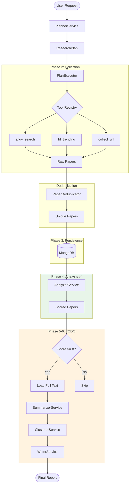

# Data Flow - Research Assistant

## Pipeline Flow (v2.4)



## Paper Processing Flow

```
RAW → SCORED → SUMMARIZED → CLUSTERED → REPORTED
 ↑       ↑          ↑           ↑           ↑
 │       │          │           │           │
Collect  Analyze   [TODO]      [TODO]     [TODO]
```

## Full Text Loading Strategy (TODO)

```python
# Only load PDF for high-relevance papers
if paper.relevance_score >= 8:
    pdf_content = await pdf_parser.parse(paper.pdf_url)
    paper.full_text = pdf_content
```

Benefits:
- Save bandwidth (only ~20% of papers)
- Faster pipeline
- Cost effective (less LLM tokens)

## Key Data Structures

### Paper (MongoDB)
```json
{
  "arxiv_id": "2602.04739",
  "title": "...",
  "abstract": "...",
  "pdf_url": "https://arxiv.org/pdf/...",
  "relevance_score": 9,
  "full_text": null,  // TODO: lazy load
  "summary": null,    // TODO: SummarizerService
  "status": "scored"
}
```

### ExecutionProgress
```python
ExecutionProgress(
    total_papers_collected=112,
    unique_papers=99,
    duplicates_removed=13
)
```
