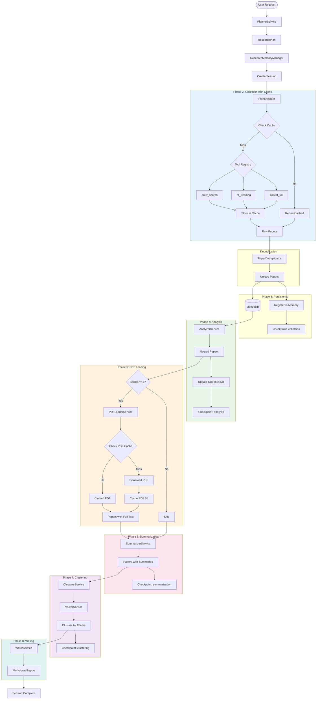
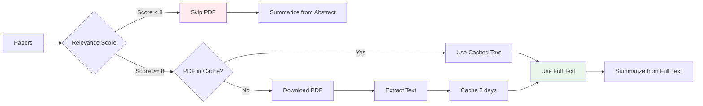

# Data Flow - Research Assistant (v3.0 - Phase 1-2)

## Complete Pipeline Flow



## Paper Processing Flow

```
RAW → DEDUPLICATED → PERSISTED → SCORED → LOADED → SUMMARIZED → CLUSTERED → REPORTED
 ↑         ↑            ↑           ↑         ↑          ↑            ↑           ↑
 │         │            │           │         │          │            │           │
Tool    Dedup       MongoDB     Analyzer   PDF      Summarizer   Clusterer   Writer
Cache                                      Loader
(Redis)                                   (Redis)
```

## Data Layer Architecture

```
┌─────────────────────────────────────────────────────────┐
│                   Application Layer                      │
│        (ResearchPipeline orchestrates all phases)        │
└─────────────────────────────────────────────────────────┘
                           ↓
┌─────────────────────────────────────────────────────────┐
│                  Memory Management                       │
│                                                          │
│  ┌──────────┐  ┌──────────┐  ┌──────────┐             │
│  │   Hot    │  │   Warm   │  │   Cold   │             │
│  │In-Process│→ │  Redis   │→ │ MongoDB  │             │
│  │ Registry │  │Sessions  │  │ Papers   │             │
│  └──────────┘  └──────────┘  └──────────┘             │
└─────────────────────────────────────────────────────────┘
                           ↓
┌─────────────────────────────────────────────────────────┐
│                    Cache Layer                           │
│                                                          │
│  Tool Cache (Redis)          PDF Cache (Redis)          │
│  - TTL: 1h (ArXiv)           - TTL: 7d                  │
│  - TTL: 30m (HF)             - Key: pdf_url             │
│  - Key: tool+args            - Lazy loading             │
└─────────────────────────────────────────────────────────┘
```

## Full Text Loading Strategy



**Benefits:**
- Save bandwidth (only ~20% of papers typically score ≥8)
- Faster pipeline
- Cost effective (less LLM tokens)
- Cached PDFs avoid re-downloads

## Key Data Structures

### Paper (MongoDB)
```json
{
  "arxiv_id": "2602.04739",
  "title": "...",
  "abstract": "...",
  "pdf_url": "https://arxiv.org/pdf/...",
  "relevance_score": 9,
  "full_text": "... (only if score >= 8) ...",
  "summary": {
    "problem": "...",
    "method": "...",
    "result": "...",
    "one_sentence_summary": "..."
  },
  "status": "completed",
  "plan_id": "abc-123",
  "created_at": "2026-02-06T..."
}
```

### ResearchSession (Memory Manager)
```python
{
  "session_id": "abc-123",
  "topic": "Transformer Models",
  "current_phase": "complete",
  "phases_completed": ["planning", "execution", "analysis", ...],
  "total_papers": 42,
  "unique_papers": 42,
  "high_relevance_papers": 8,
  "plan_id": "xyz-789",
  "report_id": "report-456"
}
```

### ExecutionProgress (Enhanced)
```python
{
  "total_papers_collected": 112,
  "unique_papers": 99,
  "duplicates_removed": 13,
  "high_relevance_papers": 20,
  "relevance_bands": {
    "3-5": 45,
    "6-7": 34,
    "8-10": 20
  },
  "cache_hits": 12,
  "cache_misses": 15,
  "cache_hit_rate": 0.444,
  "avg_step_duration": 3.2,
  "total_duration_seconds": 48.5
}
```

### PipelineResult
```python
{
  "session_id": "abc-123",
  "topic": "...",
  "unique_papers": 42,
  "relevant_papers": 25,
  "high_relevance_papers": 8,
  "papers_with_full_text": 8,
  "papers_with_summaries": 25,
  "clusters_created": 4,
  "cache_hit_rate": 0.45,
  "clusters": [...],
  "report_markdown": "# Research Report...",
  "duration_seconds": 45.3
}
```

## Cache Key Patterns

### Tool Cache
```
tool_cache:arxiv_search:<md5(args)>
tool_cache:hf_trending:<md5(args)>
```

### PDF Cache
```
pdf_cache:<pdf_url>
```

### Session Cache
```
session:<session_id>
checkpoint:<session_id>:<phase_id>
```

## Phase Transitions

```
IDLE → PLANNING → EXECUTION → ANALYSIS → SUMMARIZATION → CLUSTERING → WRITING → COMPLETE
  ↑                                                                                  │
  └──────────────────────────────────────────────────────────────────────────────────┘
                           (New research request)
```

Each transition creates a checkpoint in Redis for resume capability.
