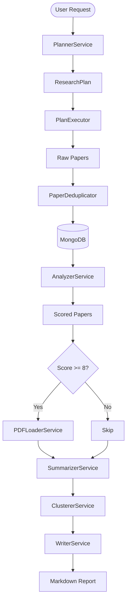

# Data Flow - Research Assistant (v4.0 - Citation-First)

## Citation-First Pipeline Flow (Default)

```mermaid
flowchart TD
    Input([User Request]) --> Planner[AdaptivePlannerService]
    Planner --> Plan[AdaptivePlan + PhaseConfig]

    Plan --> MemInit[ResearchMemoryManager]
    MemInit --> Session[Create Session]

    Session --> Executor[PlanExecutor]

    subgraph Phase2[Phase 2: Collection with Cache]
        Executor --> Cache{Check Cache}
        Cache -->|Hit| Cached[Return Cached]
        Cache -->|Miss| Tool{Tool Registry}
        Tool --> Arxiv[arxiv_search]
        Tool --> HF[hf_trending]
        Tool --> Collect[collect_url]
        Arxiv & HF & Collect --> CacheStore[Store in Cache]
        CacheStore --> Raw[Raw Papers]
        Cached --> Raw
    end

    subgraph Dedup[Deduplication]
        Raw --> Deduplicator[PaperDeduplicator]
        Deduplicator --> Unique[Unique Papers]
    end

    subgraph Phase3[Phase 3: Persistence]
        Unique --> MongoDB[(MongoDB)]
        Unique --> MemReg[Register in Memory]
        MemReg --> Checkpoint1[Checkpoint: collection]
    end

    subgraph Phase4[Phase 4: Screening]
        MongoDB --> Screener[ScreenerService]
        Screener --> BatchScreen[Batch LLM Screening]
        BatchScreen --> Records[ScreeningRecords]
        Records --> Included[Included Papers]
        Records --> Excluded[Excluded Papers]
    end

    subgraph HITLGate[HITL Approval Gate]
        Included --> GateCheck{Papers > 15?}
        GateCheck -->|Yes| Gate[ApprovalGateManager]
        Gate --> Approve{User Approves?}
        Approve -->|Yes| Continue[Continue]
        Approve -->|No| Limit[Cap to max_pdf]
        GateCheck -->|No| Continue
    end

    subgraph Phase5[Phase 5: PDF Loading with Pages]
        Continue & Limit --> PDFLoader[PDFLoaderService]
        PDFLoader --> PDFCache{Check PDF Cache}
        PDFCache -->|Hit| CachedPDF[Cached PDF + Pages]
        PDFCache -->|Miss| Download[Download + Page Map]
        Download --> StorePDF[Cache 7d]
        CachedPDF & StorePDF --> WithText[Papers with Full Text + Page Map]
    end

    subgraph Phase6[Phase 6: Evidence Extraction]
        WithText --> Extractor[EvidenceExtractorService]
        Extractor --> StudyCards[StudyCards]
        Extractor --> Spans[EvidenceSpans with Locators]
    end

    subgraph Phase7[Phase 7: Clustering]
        StudyCards --> Clusterer[ClustererService]
        Clusterer --> Vector[VectorService]
        Vector --> Clusters[Clusters by Theme]
    end

    subgraph Phase8[Phase 8: Grounded Synthesis]
        Clusters --> Taxonomy[TaxonomyBuilder]
        Taxonomy --> TaxMatrix[TaxonomyMatrix]
        TaxMatrix --> Claims[ClaimGeneratorService]
        Claims --> ClaimList[Claims with Evidence IDs]
        TaxMatrix --> Gaps[GapMinerService]
        Gaps --> Directions[Future Directions]
        ClaimList & Directions --> Writer[GroundedWriterService]
        Writer --> Report[Grounded Markdown Report]
    end

    subgraph Phase9[Phase 9: Citation Audit]
        Report --> Audit[CitationAuditService]
        Audit --> Verify[LLM Judge: Evidence Supports Claim?]
        Verify -->|Failed| Repair[Auto-Repair Loop]
        Repair --> Verify
        Verify -->|Passed| AuditResult[AuditResult]
    end

    AuditResult --> Publish[Publish Report]
    Publish --> Complete[Session Complete]

    style Phase2 fill:#e3f2fd
    style Phase4 fill:#fff9c4
    style Phase5 fill:#fff3e0
    style Phase6 fill:#fce4ec
    style Phase7 fill:#f3e5f5
    style Phase8 fill:#e8f5e9
    style Phase9 fill:#e0f2f1
```



## Legacy Pipeline Flow (v3.x Backward-Compatible)



## Paper Processing Flow (Citation-First)

```
RAW → DEDUPLICATED → PERSISTED → SCREENED → FULLTEXT → EXTRACTED → CLUSTERED → CLAIMED → AUDITED → REPORTED
 ↑         ↑            ↑           ↑          ↑           ↑           ↑          ↑          ↑          ↑
 │         │            │           │          │           │           │          │          │          │
Tool    Dedup       MongoDB    Screener     PDF       Evidence     Clusterer  Claim     Citation  Grounded
Cache                                      Loader    Extractor               Generator  Audit     Writer
(Redis)                                   (Redis)
```

## Data Layer Architecture

```
┌─────────────────────────────────────────────────────────┐
│                   Application Layer                      │
│    (ResearchPipeline orchestrates citation-first flow)   │
└─────────────────────────────────────────────────────────┘
                           ↓
┌─────────────────────────────────────────────────────────┐
│                  Memory Management                       │
│                                                          │
│  ┌──────────┐  ┌──────────┐  ┌──────────┐             │
│  │   Hot    │  │   Warm   │  │   Cold   │             │
│  │In-Process│→ │  Redis   │→ │ MongoDB  │             │
│  │ Registry │  │Sessions  │  │Papers    │             │
│  └──────────┘  └──────────┘  │Evidence  │             │
│                               │StudyCards│             │
│                               │Claims    │             │
│                               └──────────┘             │
└─────────────────────────────────────────────────────────┘
                           ↓
┌─────────────────────────────────────────────────────────┐
│                    Cache Layer                           │
│                                                          │
│  Tool Cache (Redis)    PDF Cache (Redis)                │
│  - TTL: 1h (ArXiv)    - pdf_cache: 7d (plain)          │
│  - TTL: 30m (HF)      - pdf_pages_cache: 7d (w/ pages) │
│  - Key: tool+args      - Key: pdf_url                   │
└─────────────────────────────────────────────────────────┘
```

## Full Text Loading Strategy (Citation-First)


**Key Difference from Legacy:**
- All screened-included papers get PDF loading (not just score >= 8)
- Page mapping tracks per-page character offsets for snippet localization
- PDF hash enables deduplication at content level
- Snippets are resolved to exact page/section/character positions

## Key Data Structures

### EvidenceSpan (Citation-First Core Primitive)
```json
{
  "span_id": "uuid",
  "paper_id": "paper-uuid",
  "field": "method",
  "snippet": "We use a transformer encoder with 12 attention heads...",
  "locator": {
    "page": 3,
    "section": "3.1 Architecture",
    "char_start": 1520,
    "char_end": 1580
  },
  "confidence": 0.92,
  "source_url": "https://arxiv.org/pdf/..."
}
```

### StudyCard (Schema-Driven Extraction)
```json
{
  "card_id": "uuid",
  "paper_id": "paper-uuid",
  "problem": "Detecting network intrusions in real-time",
  "method": "Transformer-based anomaly detection",
  "datasets": ["CICIDS2017", "NSL-KDD"],
  "metrics": ["accuracy", "F1-score", "AUC"],
  "results": "97.3% accuracy on CICIDS2017",
  "limitations": "High inference latency on edge devices",
  "evidence_span_ids": ["span-1", "span-2", "span-3"]
}
```

### Claim (Atomic Citable Statement)
```json
{
  "claim_id": "uuid",
  "claim_text": "Transformer-based methods achieve >95% accuracy on CICIDS2017.",
  "evidence_span_ids": ["span-1", "span-2"],
  "theme_id": "theme-0",
  "salience_score": 0.85,
  "uncertainty_flag": false
}
```

### ScreeningRecord
```json
{
  "record_id": "uuid",
  "paper_id": "paper-uuid",
  "include": true,
  "reason_code": "relevant",
  "rationale_short": "Directly addresses transformer-based NID",
  "scored_relevance": 8
}
```

### Paper (MongoDB, Extended)
```json
{
  "arxiv_id": "2602.04739",
  "title": "...",
  "abstract": "...",
  "pdf_url": "https://arxiv.org/pdf/...",
  "relevance_score": 9,
  "full_text": "...",
  "page_map": [{"page_number": 1, "char_start": 0, "char_end": 3200, "text_preview": "..."}],
  "pdf_hash": "sha256:abc123...",
  "metadata_hash": "md5:def456...",
  "status": "extracted",
  "plan_id": "abc-123",
  "created_at": "2026-02-06T..."
}
```

### PipelineResult (Extended)
```python
{
  "session_id": "abc-123",
  "topic": "...",
  "unique_papers": 42,
  "papers_screened": 42,
  "papers_included": 25,
  "papers_excluded": 17,
  "study_cards_created": 25,
  "evidence_spans_created": 150,
  "claims_generated": 40,
  "citation_audit_pass_rate": 0.92,
  "clusters_created": 4,
  "report_markdown": "# Research Report...",
  "future_directions": [...],
  "taxonomy": {...},
  "duration_seconds": 120.5
}
```

## Cache Key Patterns

### Tool Cache
```
tool_cache:arxiv_search:<md5(args)>
tool_cache:hf_trending:<md5(args)>
```

### PDF Cache
```
pdf_cache:<pdf_url>                  # Plain text (legacy)
pdf_pages_cache:<pdf_url>            # Text + page map (citation-first)
```

### Session Cache
```
session:<session_id>
checkpoint:<session_id>:<phase_id>
```

## Phase Transitions (Citation-First)

```
IDLE → PLANNING → COLLECTION → PERSISTENCE → SCREENING → HITL_GATE →
PDF_LOADING → EVIDENCE_EXTRACTION → CLUSTERING → TAXONOMY →
CLAIM_GENERATION → GAP_MINING → GROUNDED_WRITING → CITATION_AUDIT → PUBLISH → COMPLETE
  ↑                                                                                    │
  └────────────────────────────────────────────────────────────────────────────────────┘
                           (New research request)
```

## Phase Transitions (Legacy)

```
IDLE → PLANNING → EXECUTION → ANALYSIS → SUMMARIZATION → CLUSTERING → WRITING → COMPLETE
```

Each transition creates a checkpoint in Redis for resume capability.
