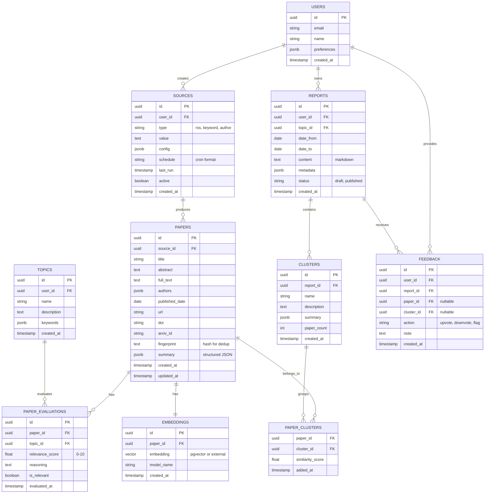

# Entity Relationship Diagram - Research Assistant

## ERD Diagram



## Table Descriptions

### Core Tables

#### `users`
System user management.
- `preferences`: JSON containing settings like LLM model preference, notification settings.

#### `sources`
Definition of sources to monitor.
- `type`: 
  - `rss`: RSS feed URL
  - `keyword`: Search query string
  - `author`: Track specific author
- `config`: JSON containing extra params (e.g., `{"max_results": 50}`)
- `schedule`: Cron expression (e.g., `"0 8 * * 1"` = every Monday 8am)

#### `papers`
Storage for paper metadata.
- `summary`: JSON structure
  ```json
  {
    "problem": "...",
    "method": "...",
    "result": "...",
    "keywords": ["a", "b"]
  }
  ```
- `fingerprint`: Hash used for deduplication
  ```python
  fingerprint = sha256(title.lower() + "|" + "|".join(sorted(authors)))
  ```

#### `topics`
User research topics (a user can track multiple topics).

#### `paper_evaluations`
Relevance evaluation results of a paper against a topic.
- Relationship: 1 paper can be evaluated against multiple topics.
- `reasoning`: LLM explanation for auditing.

### Reporting Tables

#### `reports`
Generated reports.
- `content`: Full markdown text
- `metadata`: 
  ```json
  {
    "total_papers": 23,
    "filters_applied": {...},
    "llm_model": "gemini-1.5-flash"
  }
  ```

#### `clusters`
Grouping of papers by research direction.
- Each report contains multiple clusters.
- `summary`: Overview generated by LLM.

#### `paper_clusters`
Many-to-many relationship between papers and clusters.
- 1 paper can belong to multiple clusters (edge case).
- `similarity_score`: Confidence score.

### Supporting Tables

#### `embeddings`
Vector embeddings for semantic search.
- Options:
  - **PostgreSQL pgvector extension**
  - **External Vector DB** (Qdrant, Pinecone)
- `model_name`: Track embedding model (e.g., "all-MiniLM-L6-v2")

#### `feedback`
Human-in-the-loop feedback.
- User rates results (to improve model later).

## Indexes and Constraints

### Primary Indexes
```sql
-- Performance optimization
CREATE INDEX idx_papers_date ON papers(published_date DESC);
CREATE INDEX idx_papers_source ON papers(source_id);
CREATE INDEX idx_papers_fingerprint ON papers(fingerprint);

-- Full-text search
CREATE INDEX idx_papers_title_fts ON papers USING gin(to_tsvector('english', title));
CREATE INDEX idx_papers_abstract_fts ON papers USING gin(to_tsvector('english', abstract));

-- Evaluation lookup
CREATE INDEX idx_evaluations_topic ON paper_evaluations(topic_id, relevance_score DESC);

-- Report generation
CREATE INDEX idx_clusters_report ON clusters(report_id);
```

### Constraints
```sql
-- Unique constraint for deduplication
ALTER TABLE papers ADD CONSTRAINT unique_fingerprint UNIQUE(fingerprint);

-- Check constraints
ALTER TABLE paper_evaluations 
    ADD CONSTRAINT check_score 
    CHECK (relevance_score >= 0 AND relevance_score <= 10);

-- Cascading deletes
ALTER TABLE papers 
    ADD FOREIGN KEY (source_id) 
    REFERENCES sources(id) 
    ON DELETE CASCADE;
```

## Data Migration Strategy

### Version 1 (MVP)
- Core tables: `sources`, `papers`, `reports`, `clusters`, `paper_clusters`
- SQLite for local development

### Version 2 (Production)
- Add: `users`, `topics`, `paper_evaluations`
- Migrate to PostgreSQL
- Add pgvector extension

### Version 3 (Scale)
- Add: `embeddings`, `feedback`
- Separate vector storage to Qdrant/Pinecone
- Add caching layer (Redis)
