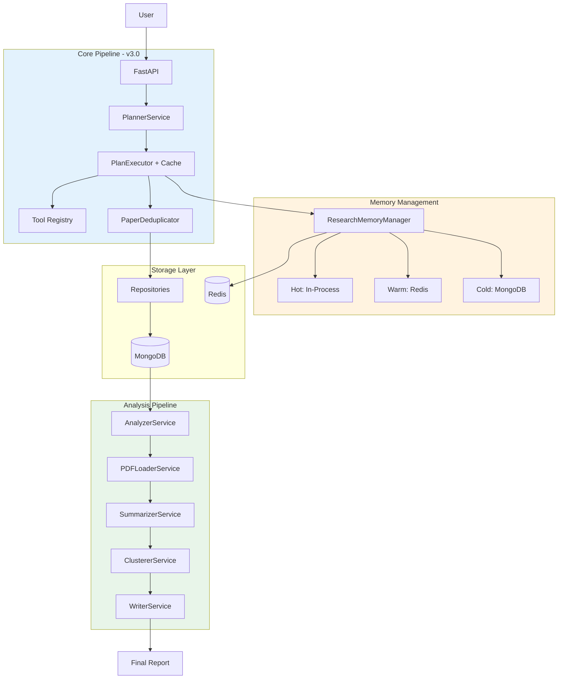

# System Design - Research Assistant (v3.0)

## Architecture Overview



## Technology Stack

| Component | Technology | Version |
|-----------|------------|---------|
| Database | MongoDB | 7.0 |
| Cache | Redis | 7.0 |
| API | FastAPI | 0.109+ |
| LLM | OpenAI / Gemini | Latest |
| Embeddings | sentence-transformers | 2.3+ |
| Clustering | scikit-learn | 1.4+ |
| PDF Parser | pypdf | Latest |
| Task Queue | Celery (future) | 5.3+ |

## Key Components (Phase 1-2)

### 1. Tool Cache Manager
**File:** `src/tools/cache_manager.py`

**Purpose:** Redis-backed caching for tool execution results

**Features:**
- Per-tool TTL configuration
  - ArXiv: 1 hour
  - HuggingFace: 30 minutes
  - URL collection: 24 hours
- MD5-based cache key generation
- Hit/miss tracking

**Cache Keys:**
```
tool_cache:arxiv_search:<md5(args)>
tool_cache:hf_trending:<md5(args)>
```

---

### 2. Research Memory Manager
**File:** `src/core/memory_manager.py`

**Purpose:** Centralized session memory with multi-layer storage

**Architecture:**
- **Hot Layer:** In-process Python dicts (fast access)
- **Warm Layer:** Redis (24h TTL, checkpoint/restore)
- **Cold Layer:** MongoDB (permanent storage)

**Features:**
- Session lifecycle management
- Phase transition tracking
- Paper registry with deduplication
- Checkpoint/restore at phase boundaries
- Analysis context generation

**Session States:**
```
IDLE → PLANNING → EXECUTION → ANALYSIS →
SUMMARIZATION → CLUSTERING → WRITING → COMPLETE
```

---

### 3. PDF Loader Service
**File:** `src/research/analysis/pdf_loader.py`

**Purpose:** Selective full-text loading with caching

**Strategy:**
- Only load PDFs for papers with `relevance_score >= 8.0`
- Cache PDFs in Redis (7-day TTL)
- Graceful fallback if download fails

**Benefits:**
- ~80% bandwidth savings (only high-value papers)
- Faster pipeline execution
- Reduced LLM token costs

---

### 4. Enhanced Executor
**File:** `src/planner/executor.py`

**Enhancements:**
- Integrated cache manager
- Enhanced `ExecutionProgress` metrics:
  - Cache hit rate
  - Average step duration
  - Relevance bands (3-5, 6-7, 8-10)
  - High-relevance paper count

---

### 5. Complete Pipeline
**File:** `src/research/pipeline.py`

**8-Phase Workflow:**

1. **Planning** - Generate research plan from topic
2. **Execution** - Collect papers (cache-aware)
3. **Persistence** - Save to MongoDB
4. **Analysis** - Score relevance (abstract-only)
5. **PDF Loading** - Load full text (score >= 8)
6. **Summarization** - Generate structured summaries
7. **Clustering** - Group by semantic theme
8. **Writing** - Generate Markdown report

**Integration:**
- ResearchMemoryManager for session tracking
- ToolCacheManager for performance
- Checkpoints at each major phase

---

## Collections (MongoDB)

| Collection | Description | Key Fields |
|------------|-------------|------------|
| papers | Research papers | arxiv_id, title, abstract, full_text, relevance_score, summary |
| clusters | Paper groupings | name, description, paper_ids |
| reports | Generated reports | content, metadata, session_id |
| plans | Research plans | topic, steps, status |

---

## Redis Key Patterns

### Tool Cache
```
tool_cache:{tool_name}:{md5(args)}
TTL: 1h-24h (per tool)
```

### PDF Cache
```
pdf_cache:{pdf_url}
TTL: 7 days
```

### Session Data
```
session:{session_id}
TTL: 24 hours
```

### Checkpoints
```
checkpoint:{session_id}:{phase_id}
TTL: 24 hours
```

---

## Performance Characteristics

### Cache Hit Rates (Expected)
- First run: 0% (cold start)
- Second run (same topic): 60-80%
- Repeated searches: 80-95%

### Pipeline Timing (Typical)
- Planning: 2-5s
- Execution (no cache): 20-40s
- Execution (cached): 2-5s
- Analysis: 15-30s
- PDF Loading: 5-15s (for ~20% of papers)
- Summarization: 10-20s
- Clustering: 2-5s
- Writing: 1-3s

**Total:** 45-90s (first run), 15-30s (cached)

### Resource Usage
- Memory: ~500MB baseline, +50MB per 100 papers
- MongoDB: ~1KB per paper (no full text), ~50KB with full text
- Redis: ~10KB per cached tool result, ~50KB per cached PDF

---

## API Endpoints (Current)

### Implemented
```
POST /api/plans - Create research plan
GET  /api/plans/{id} - Get plan details
PUT  /api/plans/{id} - Update plan
```

### Planned (Phase 3)
```
POST /api/research - Execute full pipeline
GET  /api/research/{session_id} - Get session status
GET  /api/research/{session_id}/report - Get final report
POST /api/research/{session_id}/checkpoint - Save checkpoint
POST /api/research/{session_id}/restore - Restore from checkpoint
```

---

## Configuration

### Environment Variables
```bash
# MongoDB
MONGO_URL=mongodb://localhost:27017
MONGO_DB_NAME=research_assistant

# Redis
REDIS_URL=redis://localhost:6379/0

# LLM
GEMINI_API_KEY=your_key
OPENAI_API_KEY=your_key
```

### Cache TTLs
**File:** `src/tools/cache_manager.py`
```python
TTL_CONFIG = {
    "arxiv_search": 3600,           # 1 hour
    "arxiv_search_keywords": 3600,
    "hf_trending": 1800,            # 30 min
    "collect_url": 86400,           # 24 hours
}
```

### PDF Loading Threshold
**File:** `src/research/analysis/pdf_loader.py`
```python
relevance_threshold = 8.0  # Only load PDFs for score >= 8
```

---

## Scaling Strategy

### Current (Single Instance)
- Handles: ~100 papers per request
- Concurrent requests: Limited by LLM API rate limits
- Storage: Suitable for up to 10K papers

### Future (Phase 4+)
- Celery task queue for async processing
- Multiple workers for parallel execution
- Redis cluster for distributed caching
- MongoDB sharding for large datasets
- Rate limiting and backpressure handling

---

## Security Considerations

### Current
- Environment-based secrets
- No authentication on API (development only)
- MongoDB without auth (local development)

### Production Requirements
- API key authentication
- MongoDB user authentication
- Redis password protection
- Rate limiting per user
- Input validation and sanitization
- HTTPS only

---

## Monitoring & Observability

### Metrics Tracked
- Pipeline execution time
- Cache hit/miss rates
- Papers collected per source
- Relevance distribution
- PDF download success rate
- LLM token usage (via provider APIs)

### Logging
- Structured logging with `structlog`
- Log levels: DEBUG, INFO, WARNING, ERROR
- Request tracing via session IDs
- Phase transition logging

### Future
- Prometheus metrics export
- Grafana dashboards
- Error rate alerting
- Performance degradation detection

---

## Deployment

### Development
```bash
docker-compose up -d  # MongoDB + Redis
python scripts/test_phase_1_2.py
```

### Production (Future)
- Docker containers for all services
- Kubernetes for orchestration
- Load balancer for API
- Managed MongoDB (Atlas)
- Managed Redis (AWS ElastiCache)
- CDN for static assets
