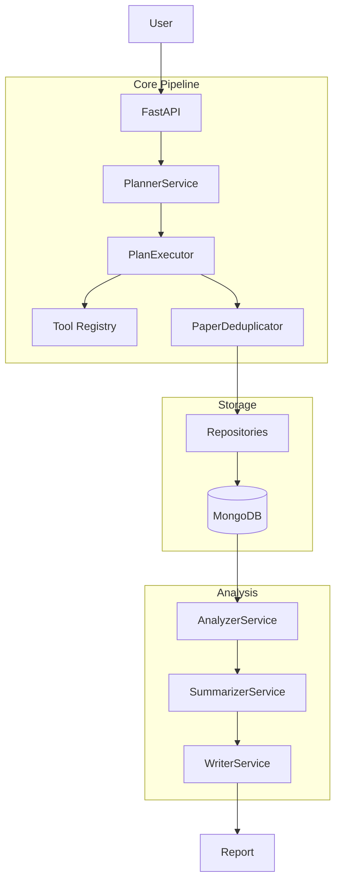

# System Design - Research Assistant

## Architecture (v2.3)

## Technology Stack

| Component | Technology |
|-----------|------------|
| Database | MongoDB 7 (motor) |
| Cache | Redis 7 |
| API | FastAPI |
| LLM | OpenAI / Gemini |

## Key Features

### PaperDeduplicator
- Level 1: ArXiv ID
- Level 2: Fingerprint (title + author hash)
- Level 3: Title similarity (85%)

### AnalyzerService
- Batch processing (10 papers/batch)
- Abstract-only (no full text)
- Relevance threshold: 7.0

## Collections

| Collection | Description |
|------------|-------------|
| papers | Research papers with scores |
| clusters | Paper groupings by theme |
| reports | Generated reports |
