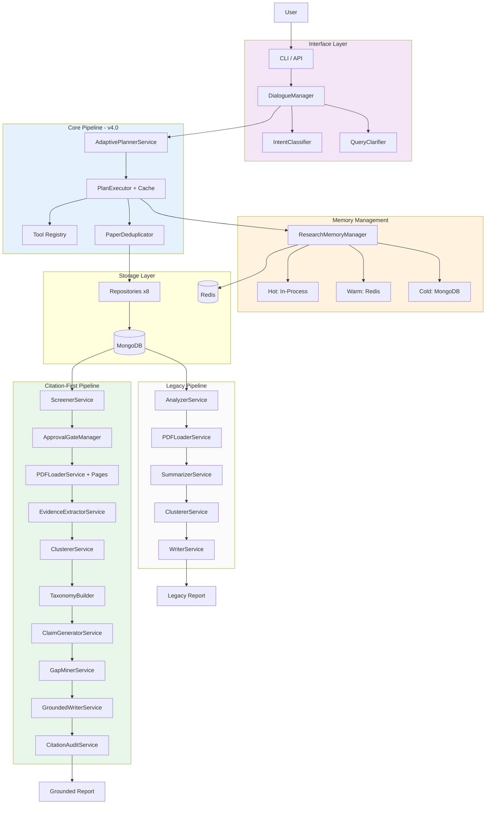

# System Design - Research Assistant (v4.0 - Citation-First)

## Architecture Overview



## Technology Stack

| Component | Technology | Version |
|-----------|------------|---------|
| Database | MongoDB | 7.0 |
| Cache | Redis | 7.0 |
| API | FastAPI | 0.109+ |
| LLM | OpenAI / Gemini | Latest |
| Embeddings | sentence-transformers | 2.3+ |
| Clustering | scikit-learn | 1.4+ |
| PDF Parser | pypdf | Latest |
| Task Queue | Celery (future) | 5.3+ |

## Key Components (Phase 1-6)

### 1. CLI Interface
**File:** `src/cli/`

**Purpose:** Interactive command-line interface with streaming output

**Components:**
- `ResearchDisplay` - Rich-based themed console output
- `StreamingDisplay` - Live progress updates during execution
- `ResearchCLI` - Main application loop with conversation flow

**Features:**
- Colorful panels, tables, markdown rendering
- Streaming LLM responses (typewriter effect)
- Progress indicators for pipeline phases
- Commands: `/ask`, `/explain` with streaming

---

### 2. Dialogue Manager
**File:** `src/conversation/dialogue.py`

**Purpose:** Conversation orchestration with state machine

**States:**
```
IDLE → CLARIFYING → PLANNING → REVIEWING → EXECUTING → COMPLETE
```

**Features:**
- Multi-turn dialogue with context
- Intent classification (approve, reject, edit, new_research)
- Query clarification ("Think Before Plan")
- Progress callback support for streaming

---

### 3. LLM Adapters with Streaming
**File:** `src/adapters/llm.py`

**Purpose:** Unified interface for OpenAI and Gemini with streaming

**Interface:**
```python
class LLMClientInterface(ABC):
    async def generate(self, prompt: str, ...) -> str
    async def generate_stream(self, prompt: str, ...) -> AsyncIterator[str]
```

**Implementations:**
- `GeminiAdapter` - Google Gemini with `stream=True`
- `OpenAIAdapter` - OpenAI with streaming chunks

---

### 4. Tool Cache Manager
**File:** `src/tools/cache_manager.py`

**Purpose:** Redis-backed caching for tool execution results

**Features:**
- Per-tool TTL configuration
  - ArXiv: 1 hour
  - HuggingFace: 30 minutes
  - URL collection: 24 hours
- MD5-based cache key generation
- Hit/miss tracking

---

### 5. Screener Service (Citation-First)
**File:** `src/research/analysis/screener.py`

**Purpose:** Systematic paper screening with include/exclude decisions

**Features:**
- Batch LLM screening (batch size: 15)
- Reason codes: relevant, out_of_scope, survey_only, missing_eval, duplicate_work, insufficient_detail
- Graceful fallback: includes all papers on error
- Returns (included_papers, screening_records) tuple

---

### 6. Evidence Extractor (Citation-First)
**File:** `src/research/analysis/evidence_extractor.py`

**Purpose:** Extract structured evidence from paper full text

**Features:**
- Schema-driven extraction: problem, method, datasets, metrics, results, limitations
- Each field backed by verbatim EvidenceSpan with locator
- Locator resolution via pdf_loader for page/section/char positions
- Falls back to abstract if no full text available

---

### 7. Claim Generator (Citation-First)
**File:** `src/research/synthesis/claim_generator.py`

**Purpose:** Generate atomic citable statements from evidence

**Features:**
- Generates 3-8 claims per theme cluster
- Each claim requires ≥1 valid evidence_span_id
- Salience scoring (0-1) and uncertainty flagging
- Validates evidence span IDs against provided spans

---

### 8. Grounded Writer (Citation-First)
**File:** `src/research/synthesis/grounded_writer.py`

**Purpose:** Generate citation-grounded Markdown reports

**Report sections:**
1. Scope & Search Strategy
2. Theme Map (cluster overview)
3. Per-theme Synthesis (LLM-generated with inline citations)
4. Comparative Table (datasets × metrics from taxonomy)
5. Limitations (aggregated from study cards)
6. Future Directions (from gap miner)
7. References

---

### 9. Citation Audit (Citation-First)
**File:** `src/research/synthesis/citation_audit.py`

**Purpose:** Verify claims are properly supported by evidence

**Process:**
1. Select claims above salience threshold (0.3)
2. LLM judge verifies evidence semantically supports claim
3. Failed claims: auto-repair (conservative rewrite or mark uncertain)

**Result:** AuditResult with pass_rate metric

---

### 10. Gap Miner (Citation-First)
**File:** `src/research/synthesis/gap_miner.py`

**Purpose:** Discover future research directions

**Sources:**
- Limitations from study cards
- Taxonomy holes (empty cells in themes × datasets × metrics)
- Contradictions (conflicting results on same dataset+metric)

---

### 11. Approval Gate Manager (HITL)
**File:** `src/research/gates.py`

**Purpose:** Human-in-the-loop approval for high-cost actions

**Gate types:**
- `pdf_download` - Triggered when > 15 papers need PDF download
- `external_crawl` - Triggered for non-standard domains (not arxiv/hf)
- `high_token_budget` - Triggered when estimated tokens > 100k

**Behavior:** Auto-approves in development mode (no callback set)

---

### 12. Research Memory Manager
**File:** `src/core/memory_manager.py`

**Purpose:** Centralized session memory with multi-layer storage

**Architecture:**
- **Hot Layer:** In-process Python dicts (fast access)
- **Warm Layer:** Redis (24h TTL, checkpoint/restore)
- **Cold Layer:** MongoDB (permanent storage)

---

### 13. PDF Loader Service
**File:** `src/research/analysis/pdf_loader.py`

**Purpose:** PDF loading with page mapping for citation-first workflow

**Citation-first enhancements:**
- `load_full_text_with_pages()` - Extracts text + per-page char offsets
- `resolve_locator()` - Maps snippet to page/section/char position
- SHA256 hash for content-level deduplication
- Redis cache for page-mapped PDFs (`pdf_pages_cache:` prefix)

**Legacy mode:** Selective loading for papers with `relevance_score >= 8.0`

---

### 14. Complete Pipeline
**File:** `src/research/pipeline.py`

**Citation-First Workflow (10+ phases):**

1. **Planning** - Generate research plan (adaptive QUICK/FULL)
2. **Collection** - Collect papers (cache-aware) + deduplication
3. **Persistence** - Save to MongoDB
4. **Screening** - Systematic include/exclude via ScreenerService
5. **HITL Gate** - Approval for PDF downloads
6. **PDF Loading** - Full text with page mapping
7. **Evidence Extraction** - StudyCards + EvidenceSpans
8. **Clustering** - Theme grouping
9. **Synthesis** - Taxonomy → Claims → Gaps → Grounded report
10. **Citation Audit** - LLM judge + auto-repair
11. **Publish** - Save final report

**Legacy Workflow (8 phases):**
Activated with `use_citation_workflow=False`

1. Planning → 2. Execution → 3. Persistence → 4. Analysis →
5. PDF Loading → 6. Summarization → 7. Clustering → 8. Writing

---

## Collections (MongoDB)

| Collection | Description | Key Fields |
|------------|-------------|------------|
| papers | Research papers | arxiv_id, title, abstract, full_text, relevance_score, summary, page_map, pdf_hash, status |
| clusters | Paper groupings | name, description, paper_ids |
| reports | Generated reports | content, metadata, session_id |
| plans | Research plans | topic, steps, status |
| screening_records | Include/exclude decisions | paper_id, include, reason_code, rationale_short, scored_relevance |
| evidence_spans | Verbatim snippets with locators | paper_id, field, snippet, locator, confidence, source_url |
| study_cards | Schema-driven paper extractions | paper_id, problem, method, datasets, metrics, results, limitations, evidence_span_ids |
| claims | Atomic citable statements | claim_text, evidence_span_ids, theme_id, salience_score, uncertainty_flag |

---

## Redis Key Patterns

### Tool Cache
```
tool_cache:{tool_name}:{md5(args)}
TTL: 1h-24h (per tool)
```

### PDF Cache
```
pdf_cache:{pdf_url}                  # Plain text (legacy)
pdf_pages_cache:{pdf_url}            # Text + page map (citation-first)
TTL: 7 days
```

### Session Data
```
session:{session_id}
TTL: 24 hours
```

### Checkpoints
```
checkpoint:{session_id}:{phase_id}
TTL: 24 hours
```

---

## Performance Characteristics

### Cache Hit Rates (Expected)
- First run: 0% (cold start)
- Second run (same topic): 60-80%
- Repeated searches: 80-95%

### Pipeline Timing (Typical)
- Planning: 2-5s
- Execution (no cache): 20-40s
- Execution (cached): 2-5s
- Analysis: 15-30s
- PDF Loading: 5-15s (for ~20% of papers)
- Summarization: 10-20s
- Clustering: 2-5s
- Writing: 1-3s

**Total:** 45-90s (first run), 15-30s (cached)

### Resource Usage
- Memory: ~500MB baseline, +50MB per 100 papers
- MongoDB: ~1KB per paper (no full text), ~50KB with full text
- Redis: ~10KB per cached tool result, ~50KB per cached PDF

---

## API Endpoints (v3.4)

### Conversations (Implemented)
```
POST /api/v1/conversations - Start conversation
GET  /api/v1/conversations/{id} - Get conversation state
POST /api/v1/conversations/{id}/messages - Send message
DELETE /api/v1/conversations/{id} - Delete conversation
GET  /api/v1/conversations/{id}/stream - SSE for progress
```

### WebSocket (Implemented)
```
WS /api/v1/ws/{conversation_id} - Real-time bidirectional
```

### Plans (Legacy)
```
POST /api/v1/plan - Create research plan
GET  /api/v1/plan/{id} - Get plan details
PUT  /api/v1/plan/{id} - Update plan
POST /api/v1/plan/{id}/execute - Start execution
DELETE /api/v1/plan/{id} - Delete plan
```

---

---

## Configuration

### Environment Variables
```bash
# MongoDB
MONGO_URL=mongodb://localhost:27017
MONGO_DB_NAME=research_assistant

# Redis
REDIS_URL=redis://localhost:6379/0

# LLM
GEMINI_API_KEY=your_key
OPENAI_API_KEY=your_key
```

### Cache TTLs
**File:** `src/tools/cache_manager.py`
```python
TTL_CONFIG = {
    "arxiv_search": 3600,           # 1 hour
    "arxiv_search_keywords": 3600,
    "hf_trending": 1800,            # 30 min
    "collect_url": 86400,           # 24 hours
}
```

### PDF Loading Threshold
**File:** `src/research/analysis/pdf_loader.py`
```python
relevance_threshold = 8.0  # Only load PDFs for score >= 8
```

---

## Scaling Strategy

### Current (Single Instance)
- Handles: ~100 papers per request
- Concurrent requests: Limited by LLM API rate limits
- Storage: Suitable for up to 10K papers

### Future (Phase 4+)
- Celery task queue for async processing
- Multiple workers for parallel execution
- Redis cluster for distributed caching
- MongoDB sharding for large datasets
- Rate limiting and backpressure handling

---

## Security Considerations

### Current
- Environment-based secrets
- No authentication on API (development only)
- MongoDB without auth (local development)

### Production Requirements
- API key authentication
- MongoDB user authentication
- Redis password protection
- Rate limiting per user
- Input validation and sanitization
- HTTPS only

---

## Monitoring & Observability

### Metrics Tracked
- Pipeline execution time
- Cache hit/miss rates
- Papers collected per source
- Relevance distribution
- PDF download success rate
- LLM token usage (via provider APIs)

### Logging
- Structured logging with `structlog`
- Log levels: DEBUG, INFO, WARNING, ERROR
- Request tracing via session IDs
- Phase transition logging

### Future
- Prometheus metrics export
- Grafana dashboards
- Error rate alerting
- Performance degradation detection

---

## Deployment

### Development
```bash
docker-compose up -d  # MongoDB + Redis
python scripts/test_phase_1_2.py
```

### Production (Future)
- Docker containers for all services
- Kubernetes for orchestration
- Load balancer for API
- Managed MongoDB (Atlas)
- Managed Redis (AWS ElastiCache)
- CDN for static assets
