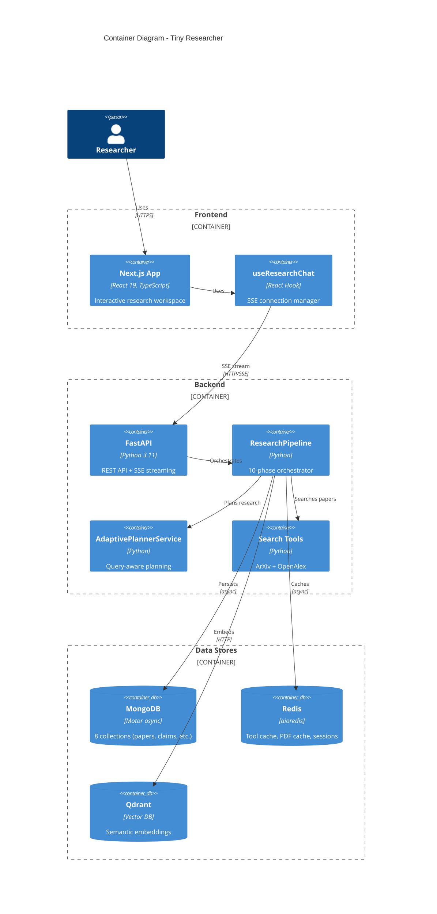
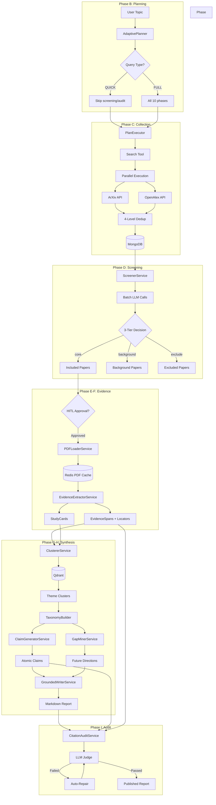
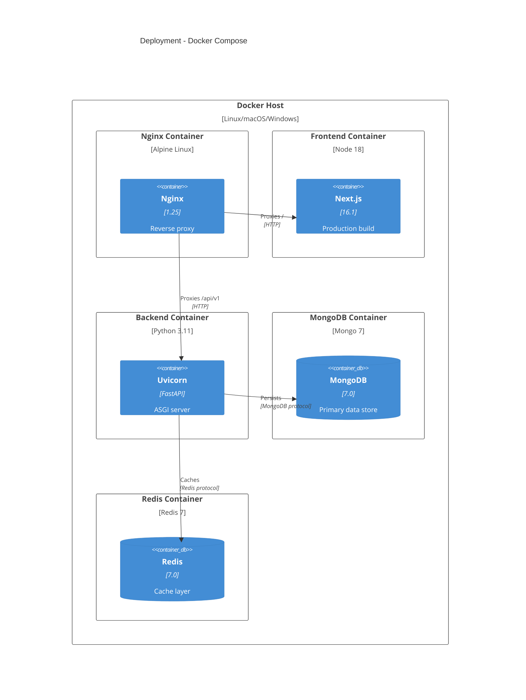

# Architecture Overview

```text
Related code:
- backend/src/research/pipeline.py:148-733
- backend/docs/dataflow.md:1-331
- backend/src/planner/adaptive_planner.py:1-200
- backend/src/storage/repositories.py:1-500
- frontend/src/hooks/useResearchChat.ts:1-400
```

## Design Rationale

The architecture is designed around **three core principles**:

1. **Citation Integrity**: Every claim in the final report must be traceable to specific evidence with page-level locators. This prevents LLM hallucination and ensures academic rigor.

2. **3-Tier Memory**: Hot (in-process) → Warm (Redis) → Cold (MongoDB) balances latency and persistence. Expensive operations (LLM calls, PDF downloads) are cached aggressively.

3. **Async-First Streaming**: SSE (Server-Sent Events) provides real-time pipeline updates without WebSocket complexity. All I/O operations use `async/await` for concurrent processing.

**Why this matters**: Traditional literature review tools either produce unreliable LLM-generated summaries or require manual citation tracking. Tiny Researcher automates the full workflow while enforcing evidence-based claims.

## Component Diagram



**Key Containers:**

- **Next.js App**: Modern frontend with App Router, React Query for server state, CSS Modules for styling
- **FastAPI**: Async API with 7 routers (auth, papers, reports, conversations, sources, planner, websocket)
- **ResearchPipeline**: Core orchestrator managing 10-phase citation-first workflow
- **MongoDB**: Primary data store with 8 collections (papers, evidence_spans, study_cards, claims, reports, etc.)
- **Redis**: Cache layer with 3 key patterns (tool results, PDF content, sessions)

## Data Flow Diagram



**Critical Paths:**

1. **Happy Path** (FULL mode, 20 papers):
   - Planning (5s) → Collection (30s) → Screening (15s) → PDF Loading (45s) → Evidence Extraction (60s) → Clustering (20s) → Synthesis (40s) → Audit (25s)
   - Total: ~4 minutes

2. **QUICK Mode** (concept check, 5 papers):
   - Planning (3s) → Collection (10s) → Scoring (5s) → Simple Report (5s)
   - Total: ~30 seconds

3. **Error Recovery**:
   - All phases create Redis checkpoints (`checkpoint:{session_id}:{phase_id}`)
   - Pipeline can resume from last checkpoint if interrupted
   - HITL gates allow user to reject/modify before expensive operations

## Deployment View



**Port Mapping (docker-compose.yml):**
- `nginx`: 80 → Host 80 (main entry point)
- `nextjs`: 3000 → internal
- `backend`: 8000 → internal
- `mongo`: 27017 → Host 27017 (optional external access)
- `redis`: 6379 → Host 6379 (optional external access)

## Tech Debt Notes

### Debt 1: No Horizontal Scaling

**Problem**: All processing happens in-request with SSE streaming. No background workers (Celery/RQ). Single FastAPI instance handles all requests.

**Impact**:
- Cannot process >10 concurrent research sessions efficiently
- Long-running pipelines (100+ papers) block other requests

**Mitigation Strategy**:
- Phase 1: Add Redis-backed job queue with Celery workers
- Phase 2: Distribute PDF loading and LLM calls across worker pool
- Phase 3: Stateless pipeline orchestration with event sourcing

**Estimated Effort**: 2-3 weeks

### Debt 2: No Vector Search for Deduplication

**Problem**: Current deduplication uses DOI → fingerprint → title similarity. Semantically similar papers with different titles slip through.

**Impact**:
- ~5% duplicate papers in final report
- Wasted LLM tokens on redundant evidence extraction

**Mitigation Strategy**:
- Add Qdrant-based semantic deduplication after fingerprint matching
- Generate embeddings for all paper abstracts
- Cluster with cosine similarity >0.9 threshold
- Keep only highest-relevance paper from each cluster

**Estimated Effort**: 1 week

### Debt 3: Frontend SSE Reconnection

**Problem**: `useResearchChat` hook doesn't implement exponential backoff reconnection. If SSE connection drops, user must refresh page.

**Impact**:
- Poor UX during network interruptions
- Lost progress updates (though pipeline continues server-side)

**Mitigation Strategy**:
- Add retry logic with exponential backoff (1s, 2s, 4s, 8s, 16s max)
- Implement last-event-id tracking for resume
- Show toast notification during reconnection attempts

**Estimated Effort**: 2 days
