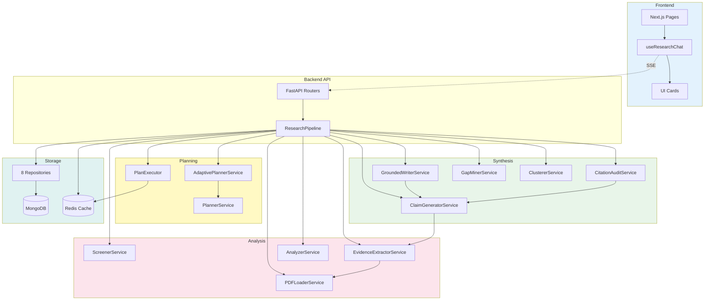

# Core Components Overview

```text
Related code:
- backend/src/research/pipeline.py:148-733
- backend/src/research/analysis/screener.py:1-150
- backend/src/research/analysis/evidence_extractor.py:1-200
- backend/src/research/synthesis/grounded_writer.py:1-250
- backend/src/planner/adaptive_planner.py:1-200
- backend/src/storage/repositories.py:1-500
- frontend/src/hooks/useResearchChat.ts:1-400
```

## Component Dictionary

### Backend Services

**ResearchPipeline** (`backend/src/research/pipeline.py`)
- **Responsibility**: Orchestrates 10-phase citation-first workflow (or legacy 8-phase)
- **Key Files**: `pipeline.py:148-733`
- **Dependencies**: Planner, Executor, all analysis/synthesis services
- **Why it exists**: Central coordinator that enforces phase order and manages HITL gates

**AdaptivePlannerService** (`backend/src/planner/adaptive_planner.py`)
- **Responsibility**: Classifies query type (QUICK vs FULL) and generates phase-optimized search plans
- **Key Files**: `adaptive_planner.py`, `query_parser.py`
- **Dependencies**: PlannerService, LLM client
- **Why it exists**: Prevents over-processing simple queries while maintaining rigor for comprehensive reviews

**ScreenerService** (`backend/src/research/analysis/screener.py`)
- **Responsibility**: Systematic paper screening with 3-tier decisions (core/background/exclude)
- **Key Files**: `screener.py`, `core/prompts.py` (SCREENING_PROMPT)
- **Dependencies**: LLM client, Paper model
- **Why it exists**: Replaces simple relevance scoring with structured include/exclude rationale

**EvidenceExtractorService** (`backend/src/research/analysis/evidence_extractor.py`)
- **Responsibility**: Schema-driven extraction of StudyCards and EvidenceSpans with page locators
- **Key Files**: `evidence_extractor.py`, `utils/pdf_parser.py`
- **Dependencies**: PDFLoaderService, LLM client
- **Why it exists**: Enables citation traceability by linking claims to specific PDF pages/sections

**ClaimGeneratorService** (`backend/src/research/synthesis/claim_generator.py`)
- **Responsibility**: Converts evidence spans into atomic citable claims
- **Key Files**: `claim_generator.py`, `core/prompts.py` (CLAIM_GENERATION)
- **Dependencies**: StudyCards, EvidenceSpans, Clusters
- **Why it exists**: Ensures all statements in final report have explicit evidence backing

**GroundedWriterService** (`backend/src/research/synthesis/grounded_writer.py`)
- **Responsibility**: Generates Markdown reports with inline citations to evidence spans
- **Key Files**: `grounded_writer.py`, `core/prompts.py` (GROUNDED_REPORT)
- **Dependencies**: Claims, EvidenceSpans, TaxonomyMatrix
- **Why it exists**: Produces human-readable reports while maintaining citation integrity

**CitationAuditService** (`backend/src/research/synthesis/citation_audit.py`)
- **Responsibility**: LLM judge that verifies evidence supports claims, auto-repairs misalignments
- **Key Files**: `citation_audit.py`, `core/prompts.py` (CITATION_AUDIT)
- **Dependencies**: Claims, EvidenceSpans
- **Why it exists**: Final quality gate to catch hallucinated or weak citations

**PaperRepository** (`backend/src/storage/repositories.py`)
- **Responsibility**: CRUD operations for papers collection (8 total repositories)
- **Key Files**: `repositories.py:1-500`
- **Dependencies**: MongoDB async client
- **Why it exists**: Abstracts database operations, provides type-safe queries

### Frontend Components

**useResearchChat** (`frontend/src/hooks/useResearchChat.ts`)
- **Responsibility**: SSE connection manager, handles 15+ event types, token streaming
- **Key Files**: `useResearchChat.ts:1-400`
- **Dependencies**: Axios, EventSource API
- **Why it exists**: Single source of truth for research session state, real-time updates

**PlanCard** (`frontend/src/components/chat/PlanCard/`)
- **Responsibility**: Displays generated search plan with queries and expected sources
- **Dependencies**: Plan data from SSE stream
- **Why it exists**: Gives user visibility into search strategy before execution

**ClaimsCard** (`frontend/src/components/chat/ClaimsCard/`)
- **Responsibility**: Shows atomic claims with evidence span references
- **Dependencies**: Claims data from SSE stream
- **Why it exists**: Provides preview of grounded findings before full report

## Relationship Graph



## Critical Call Chains

### Citation-First Pipeline (Happy Path)

```
User Request
  → FastAPI conversation.router
    → ResearchPipeline.run()
      → AdaptivePlannerService.create_adaptive_plan()
        → QueryParser.classify() [QUICK or FULL]
        → PlannerService.generate_research_plan()
      → PlanExecutor.execute()
        → ToolRegistry.search() [ArXiv + OpenAlex parallel]
        → PaperDeduplicator.deduplicate() [4-level]
        → PaperRepository.create_many()
      → ScreenerService.screen_papers()
        → LLM batch calls (3-tier decision)
        → ScreeningRecordRepository.create()
      → ApprovalGateManager.check_pdf_gate() [HITL]
      → PDFLoaderService.load_batch_with_pages()
        → pdf_parser.extract_text_with_pages()
        → Redis.set(pdf_pages_cache)
      → EvidenceExtractorService.extract_batch()
        → LLM extraction (StudyCard schema)
        → StudyCardRepository.create()
        → EvidenceSpanRepository.create()
      → ClustererService.cluster_papers()
        → VectorService.embed()
        → sklearn.AgglomerativeClustering
      → TaxonomyBuilder.build_taxonomy()
      → ClaimGeneratorService.generate_claims()
        → LLM (claim + evidence IDs)
        → ClaimRepository.create()
      → GroundedWriterService.generate_report()
        → LLM (Markdown with citations)
      → CitationAuditService.audit_claims()
        → LLM judge (evidence supports claim?)
        → Auto-repair loop if failed
      → ReportRepository.create()
```

### SSE Streaming Flow

```
Frontend useResearchChat.connectSSE()
  → EventSource(GET /api/v1/conversations/{id}/stream)
    → Backend conversation.router stream_conversation()
      → ResearchPipeline.run(progress_callback)
        → notify("phase_name", "message", {...})
          → yield f"event: progress\ndata: {json}\n\n"
            → EventSource.onmessage
              → switch(event.type):
                  case "progress": Update phase status
                  case "plan": Set plan data
                  case "papers_collected": Update papers
                  case "claims": Set claims
                  case "token_stream": Append to buffer
                  case "complete": Mark session complete
```

## Component Sizing

| Component | LOC | Complexity | Test Coverage |
|-----------|-----|------------|---------------|
| ResearchPipeline | ~733 | High | Manual |
| ScreenerService | ~150 | Medium | Manual |
| EvidenceExtractorService | ~200 | High | Manual |
| GroundedWriterService | ~250 | High | Manual |
| CitationAuditService | ~180 | Medium | Manual |
| PaperRepository | ~500 (all repos) | Low | None |
| useResearchChat | ~400 | Medium | None |

**Complexity Factors:**
- **High**: Complex LLM prompts, multi-step orchestration, error handling
- **Medium**: Batch processing, structured extraction, validation logic
- **Low**: CRUD operations, type conversions
