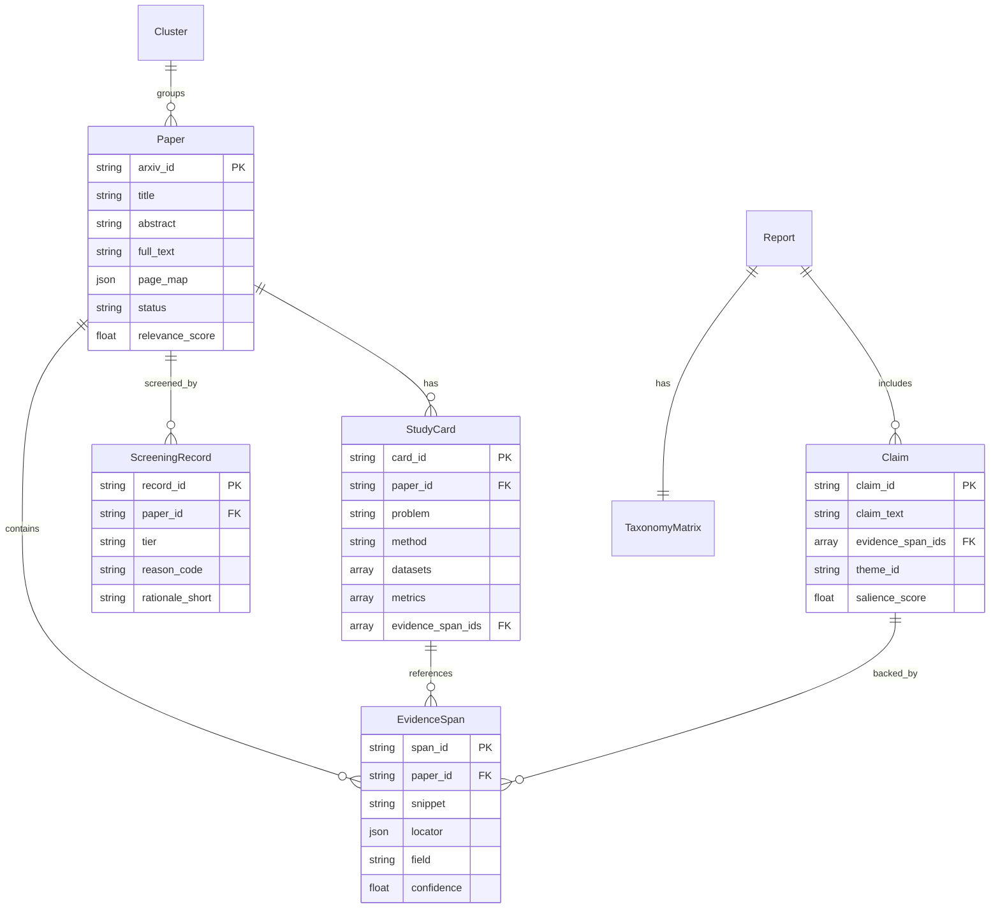

# Domain Model

```text
Related code:
- backend/src/core/models.py:1-300
- backend/docs/erd.md:1-150
- backend/docs/dataflow.md:195-270
```

## Core Domain Entities

### Paper
Primary research paper entity with metadata, processing status, and full text.

**Key Fields**:
- `arxiv_id`, `doi` - Identifiers
- `title`, `abstract`, `authors` - Metadata
- `full_text`, `page_map` - Full content with page mapping
- `status` - Processing state (RAW → SCREENED → FULLTEXT → EXTRACTED → REPORTED)
- `relevance_score` - Legacy scoring (0-10)
- `pdf_hash`, `metadata_hash` - Deduplication

### EvidenceSpan
Verbatim snippet from a paper with traceable locator (citation-first core primitive).

**Key Fields**:
- `span_id` - Deterministic ID (`{paper_id}#{sha1(snippet)[:8]}`)
- `paper_id` - Reference to source paper
- `snippet` - Max 300 chars verbatim quote
- `locator` - Page/section/char offsets
- `field` - Type (problem|method|dataset|metric|result|limitation)
- `confidence` - Extraction confidence (0.0-1.0)

### StudyCard
Schema-driven structured extraction from a paper.

**Key Fields**:
- `card_id`, `paper_id`
- `problem`, `method` - Core research question and approach
- `datasets`, `metrics`, `results` - Evaluation details
- `limitations` - Stated weaknesses
- `evidence_span_ids` - Links to supporting evidence

### Claim
Atomic citable statement for final report.

**Key Fields**:
- `claim_id`
- `claim_text` - Single statement
- `evidence_span_ids` - Supporting evidence (must be ≥1)
- `theme_id` - Cluster/theme assignment
- `salience_score` - Importance (0.0-1.0)
- `uncertainty_flag` - Flagged by citation audit

### ScreeningRecord
Systematic include/exclude decision with reason codes.

**Key Fields**:
- `paper_id`
- `tier` - core|background|exclude (3-tier system)
- `reason_code` - relevant|out_of_scope|survey|duplicate
- `rationale_short` - Brief explanation
- `scored_relevance` - Numeric score (0-10)

### TaxonomyMatrix
Multi-dimensional matrix for gap detection.

**Structure**:
- `dimensions` - E.g., ["themes", "datasets", "metrics"]
- `matrix` - 3D array showing coverage
- Enables identification of under-explored combinations

## Entity Relationships



## Data Ownership and Consistency

**Aggregates** (consistency boundaries):
1. **Paper Aggregate**: Paper + ScreeningRecord + EvidenceSpans + StudyCard
   - Lifecycle: RAW → SCREENED → FULLTEXT → EXTRACTED
   - Invariant: Cannot have EvidenceSpans without StudyCard

2. **Report Aggregate**: Report + Claims + TaxonomyMatrix
   - Lifecycle: Draft → Audited → Published
   - Invariant: All Claims must reference existing EvidenceSpans

**Write Consistency**:
- Papers: Batch inserts (create_many)
- Evidence/Claims: Individual writes (auto-repair in audit phase)
- MongoDB atomic updates for status transitions

**Read Consistency**:
- Eventually consistent (MongoDB default)
- No distributed transactions needed (single database)
