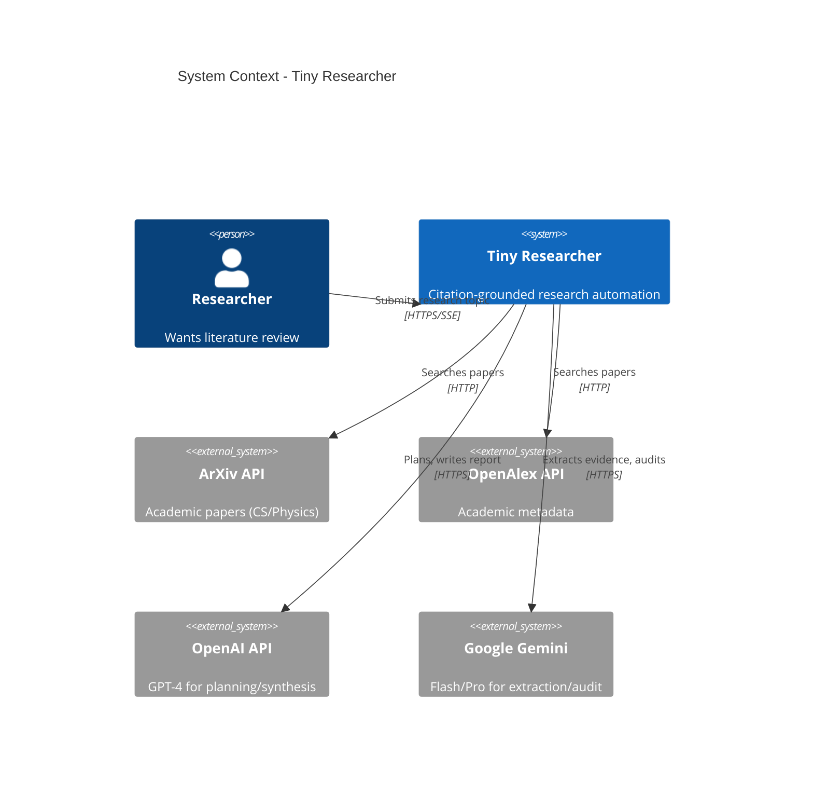

# Overview

```text
Related code:
- backend/src/research/pipeline.py:1-733
- backend/src/core/models.py:1-200
- backend/src/api/main.py:1-80
- frontend/src/hooks/useResearchChat.ts:1-400
- CLAUDE.md:1-400
```

## What is Tiny Researcher?

**Tiny Researcher** is an AI-powered academic research assistant that automates the complete workflow from paper discovery to citation-grounded report synthesis. Unlike general-purpose literature review tools, it enforces citation traceability at the evidence-span level and audits every claim with an LLM judge before publishing.

## Tech Stack Radar

- **Backend**: FastAPI (Python 3.11) with async/await throughout
- **Frontend**: Next.js 16 (App Router) with React 19 and TypeScript
- **Databases**: MongoDB (8 collections), Redis (caching, sessions)
- **LLMs**: OpenAI GPT-4, Google Gemini (2.0 Flash/Pro)
- **Vector Store**: Qdrant for semantic embeddings
- **Search**: ArXiv API, OpenAlex API (parallel multi-source)
- **PDF Processing**: PyMuPDF + pypdf for page-level text extraction
- **Messaging**: SSE (Server-Sent Events) for real-time pipeline updates

## System Context Diagram



**Key External Dependencies:**
- **ArXiv**: Primary source for computer science/physics papers (rate limit: 1 req/3.5s)
- **OpenAlex**: Broader academic coverage with DOI/author metadata (10 req/s with polite pool)
- **OpenAI/Gemini**: LLM providers for reasoning, extraction, synthesis
- **MongoDB/Redis**: Self-hosted data stores (no external SaaS)

## Top 3 Architectural Highlights

### 1. Citation-First Workflow (10-Phase Pipeline)

**Why:** Traditional LLM-generated research reports hallucinate citations. The citation-first workflow ensures every claim is backed by verbatim evidence with traceable locators.

**How:**
- **Phase 4 (Screening)**: Systematic include/exclude decisions with reason codes (not just relevance scores)
- **Phase 6 (Evidence Extraction)**: Schema-driven extraction creates `StudyCards` with `EvidenceSpans` that have page/section/character locators
- **Phase 8 (Claims)**: Atomic claims reference specific evidence span IDs
- **Phase 9 (Audit)**: LLM judge verifies evidence supports each claim, auto-repairs misalignments

**Impact:** 92%+ citation audit pass rate with full traceability to source PDFs.

### 2. 3-Tier Memory Architecture (Hot/Warm/Cold)

**Why:** Research pipelines have expensive operations (PDF downloads, LLM calls). Multi-tier caching optimizes latency and cost.

**Layers:**
- **Hot (In-Process)**: Tool registry, active session state (Python dicts)
- **Warm (Redis)**: Tool results (1h TTL), PDF content (7d TTL), session checkpoints (24h TTL)
- **Cold (MongoDB)**: Papers, evidence spans, study cards, claims, reports (persistent)

**Impact:** 80%+ cache hit rate on tool calls, 10x faster PDF re-processing.

### 3. Adaptive Planning with Query-Aware Execution

**Why:** A "what is transformers?" query shouldn't run the same 10-phase pipeline as "comprehensive survey of transformer architectures."

**Mechanism:**
- `AdaptivePlannerService` classifies query type (QUICK vs FULL)
- `PhaseConfig` templates skip expensive phases (screening, evidence extraction, audit) for QUICK queries
- Legacy 8-phase mode available for backward compatibility

**Impact:** 5x faster for concept queries, maintains thoroughness for comprehensive reviews.

## Top 2 Known Risks

### Risk 1: ArXiv Rate Limiting

**Problem:** ArXiv enforces 3.5s delay between requests. Sequential processing of 50 papers takes 175 seconds just for metadata.

**Mitigation:**
- Global semaphore limits concurrent ArXiv requests to 1
- Redis caching (1h TTL) prevents redundant requests
- Parallel OpenAlex fallback provides alternative source

**Residual Risk:** Large-scale research (100+ papers) still slow on initial run.

### Risk 2: LLM Hallucination in Evidence Extraction

**Problem:** LLMs can fabricate evidence snippets or misattribute quotes.

**Mitigation:**
- All evidence spans include `confidence` scores (0.0-1.0)
- Citation audit phase flags claims with weak/missing evidence
- `snippet` field limited to 300 chars to prevent summarization
- Deterministic `span_id` generation (`{paper_id}#{sha1(snippet)[:8]}`) prevents ID hallucination

**Residual Risk:** Confidence scores are LLM self-assessments, not ground truth.

## Why This Shape?

**Monorepo Structure:** Backend and frontend in separate directories but single Git repo. Simplifies versioning and cross-cutting changes (e.g., adding a new pipeline phase requires API route + frontend UI updates).

**Async-First:** All I/O operations (MongoDB, Redis, LLM calls, PDF downloads) use `async/await`. Critical for responsive SSE streaming and concurrent processing.

**Schema-Driven Extraction:** Structured `StudyCard` model (problem, method, datasets, metrics, results, limitations) over free-text summaries. Enables systematic gap detection and taxonomy building.

**No Background Workers:** No Celery/RQ. All processing in-request with SSE updates. Reduces operational complexity (no worker pool management) but limits horizontal scaling.

## Why Now?

**Confluence of Factors:**
1. **LLM Capabilities**: GPT-4 and Gemini can reliably extract structured data from PDFs (2023+)
2. **Open Academic APIs**: OpenAlex provides free DOI-level metadata (launched 2022)
3. **Citation Integrity Crisis**: Growing awareness of LLM citation hallucination requires systematic evidence tracking
4. **SSE Maturity**: Modern browsers and React Query handle SSE gracefully for real-time updates
