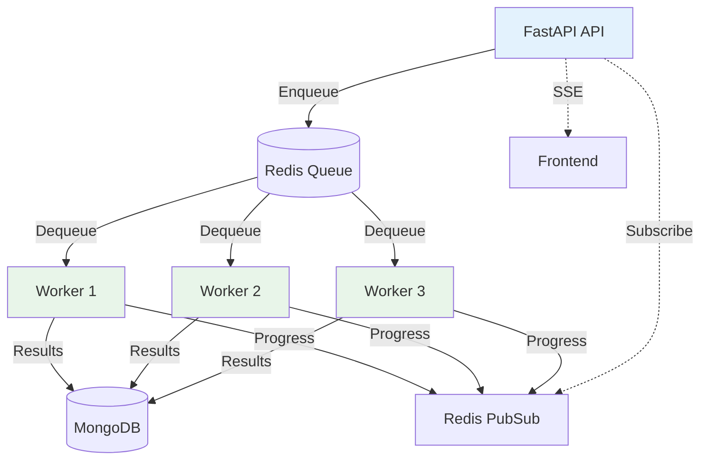

# Scaling Strategy

```text
Related code:
- backend/src/research/pipeline.py:148-733 (Pipeline orchestration)
- backend/src/tools/cache_manager.py:1-150 (Caching strategy)
- docker-compose.yml:1-150 (Current deployment)
- backend/CLAUDE.md:200-250 (Roadmap Phase 7)
```

## Current Scaling Model

**Single-Instance, In-Request Processing**

- No background workers (no Celery/RQ)
- All processing happens in FastAPI request handlers
- SSE streaming for real-time updates
- Redis for caching, MongoDB for persistence

**Capacity**:
- 10 concurrent research sessions (SSE event loop limit)
- ~240 papers/hour single-threaded (ArXiv rate limiting)
- 50k LLM tokens/min (OpenAI Tier 1 limit)

**Advantages**:
- Simple deployment (single docker-compose up)
- No worker pool management
- Immediate SSE feedback
- Easy local development

**Limitations**:
- No horizontal scaling
- Long-running pipelines block other requests
- Single point of failure

## Vertical Scaling (Easiest, 2-5x Improvement)

### 1. Increase CPU/RAM

**Target**: Handle 20-30 concurrent sessions

**Changes**:
```yaml
# docker-compose.yml
services:
  backend:
    deploy:
      resources:
        limits:
          cpus: '4'
          memory: 8G
    environment:
      UVICORN_WORKERS: 4  # Multi-process
```

**Benefits**:
- 4x concurrency (4 workers)
- Clustering phase faster (more CPU for sklearn)
- More memory for PDF caching

**Cost**: ~$50/month (AWS t3.xlarge)

### 2. Optimize LLM Calls

**Parallelize Batch Processing**:
```python
# Current (sequential)
for paper in papers:
    result = await screener.screen_paper(paper)

# Optimized (parallel)
tasks = [screener.screen_paper(p) for p in papers]
results = await asyncio.gather(*tasks)
```

**Benefits**:
- 5-10x speedup for screening/extraction phases
- Better LLM API utilization
- Reduced total pipeline time from 4min → 1min

**Cost**: Free (code change only)

### 3. Upgrade Redis

**Use Redis Cluster** (3 nodes, 3GB total):
```yaml
# docker-compose.yml
services:
  redis-master:
    image: redis:7-alpine
    volumes:
      - redis-data:/data
  redis-replica-1:
    image: redis:7-alpine
    command: redis-server --slaveof redis-master 6379
```

**Benefits**:
- 3x cache capacity (3GB vs 1GB)
- High availability (read replicas)
- Better hit rates for tool/PDF cache

**Cost**: ~$30/month (AWS ElastiCache)

## Horizontal Scaling (Medium Effort, 10x+ Improvement)

### Phase 1: Add Background Workers (2-3 weeks)

**Architecture**:


**Implementation**:
```python
# backend/src/workers/research_worker.py
from celery import Celery

app = Celery('research', broker='redis://localhost:6379/1')

@app.task
def run_screening_phase(session_id: str, papers: List[dict]):
    screener = ScreenerService(llm_client)
    results = screener.screen_papers(papers, topic)
    # Publish progress to Redis PubSub
    publish_progress(session_id, "screening", results)
    return results

# backend/src/api/routes/conversation.py
@router.post("/{id}/messages")
async def create_message(id: str, content: str):
    # Enqueue job
    job = run_screening_phase.delay(id, papers)
    return {"job_id": job.id}
```

**Benefits**:
- 10+ concurrent sessions
- Graceful degradation (queue backlog visible)
- Worker pool scales independently (3 workers → 10 workers)
- Retry logic built-in (Celery)

**Tradeoffs**:
- Operational complexity (worker lifecycle management)
- SSE becomes polling-based (check job status)
- Harder to debug (distributed tracing needed)

**Cost**: Same infrastructure, +$50/month for larger Redis

### Phase 2: Distributed PDF Processing (1 week)

**Separate PDF Worker Pool**:
```python
# backend/src/workers/pdf_worker.py
@app.task(rate_limit='100/m')  # 100 PDFs/minute
def download_and_parse_pdf(pdf_url: str):
    result = extract_text_with_pages(pdf_url)
    redis.set(f"pdf_pages_cache:{pdf_url}", result, ex=7*24*3600)
    return result

# In ResearchPipeline
tasks = [download_and_parse_pdf.delay(p.pdf_url) for p in papers]
results = [task.get(timeout=30) for task in tasks]
```

**Benefits**:
- 100 PDFs/minute (vs 20/minute single-threaded)
- Isolated failure domain (PDF errors don't crash main pipeline)
- Easy to scale (add more PDF workers)

**Cost**: ~$30/month for dedicated worker instances

### Phase 3: Multi-Region Deployment (2 weeks)

**Geographic Load Balancing**:
```
US-East: API + Workers (ArXiv)
EU-West: API + Workers (OpenAlex)
Asia-Pacific: API + Workers (Local mirrors)

Global Load Balancer → Nearest region
```

**Benefits**:
- Lower latency for PDF downloads (regional mirrors)
- Disaster recovery (multi-region failover)
- Bypass rate limits (different IP ranges)

**Cost**: ~$300/month (3 regions × $100/region)

## Extreme Scaling (100+ Sessions, 6+ months)

### Serverless Event-Driven Architecture

**AWS Lambda Functions**:
```
User Request → API Gateway → Lambda (Plan) → SQS →
  Lambda (Collect) → S3 (Papers) → Lambda (Screen) →
  Lambda (Extract) → DynamoDB (Evidence) →
  Lambda (Synthesize) → S3 (Report)
```

**Benefits**:
- Auto-scaling to 1000s of concurrent executions
- Pay-per-use (no idle costs)
- Managed infrastructure (no Kubernetes)

**Tradeoffs**:
- 15-minute Lambda timeout (requires chunking long pipelines)
- Cold start latency (500ms-2s)
- Vendor lock-in (AWS-specific)

**Cost**: ~$500/month for 1000 sessions/day

### Known Limits and Breaking Points

| Scenario | Bottleneck | Current Limit | Scaled Limit |
|----------|------------|---------------|--------------|
| **Single Session, 100 Papers** | ArXiv rate limit | 350s collection | 350s (unchanged) |
| **10 Concurrent Sessions, 20 Papers Each** | FastAPI event loop | Hangs after 5 sessions | 40 sessions (4 workers) |
| **1000 Papers/Hour** | MongoDB write throughput | OOM (Out of Memory) | 10k papers/hour (sharding) |
| **LLM Token Burst** | OpenAI API rate limit | 50k tokens/min | 500k tokens/min (Tier 3) |

## Recommended Scaling Path

**Phase 1 (Now → 3 months): Vertical + Code Optimization**
1. Parallelize LLM calls with asyncio.gather() → 5x speedup
2. Upgrade to 4-core VM with 8GB RAM → 4x concurrency
3. Optimize MongoDB bulk writes → 2x persistence speed
4. **Expected Capacity**: 20-30 concurrent sessions, 2-minute pipeline

**Phase 2 (3-6 months): Add Background Workers**
1. Implement Celery task queue
2. Separate PDF worker pool
3. Redis PubSub for progress updates
4. **Expected Capacity**: 50-100 concurrent sessions, 1-minute pipeline

**Phase 3 (6-12 months): Horizontal Scaling**
1. Multi-region deployment (US, EU, Asia)
2. MongoDB sharding for >1M papers
3. Distributed vector search (Qdrant cluster)
4. **Expected Capacity**: 500+ concurrent sessions, <1-minute pipeline

## Monitoring and Alerting

**Key Metrics to Track**:
```yaml
# Prometheus metrics
research_pipeline_duration_seconds{phase="evidence_extraction"}
research_cache_hit_rate{cache_type="pdf"}
research_llm_calls_total{provider="gemini"}
research_pdf_download_errors_total{domain="arxiv.org"}
research_concurrent_sessions_active
```

**Alert Thresholds**:
- Pipeline duration >10 minutes → Investigate slow LLM calls
- Cache hit rate <60% → Increase Redis TTL or memory
- LLM error rate >5% → Switch to fallback provider
- Concurrent sessions >8 → Scale up workers

**Dashboards**: Grafana with custom panels for pipeline phases
