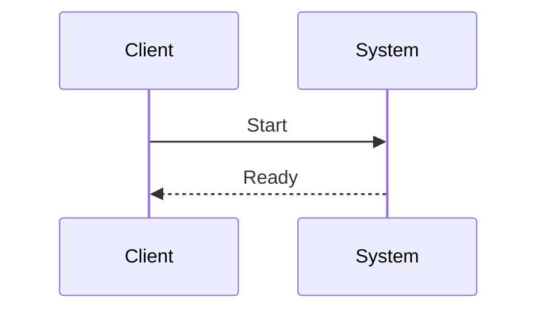

# Auth & Authz

```text
# Related Code
- `DEPLOYMENT.md`
- `DOCS.md`
- `README.md`
- `.agent\skills\codewiki-generator\references\doc-templates.md`
- `.agent\skills\codewiki-generator\references\evidence-rules.json`
- `.agent\skills\codewiki-generator\references\structure-and-heuristics.md`
- `.agent\skills\codewiki-generator\scripts\codewiki_analyze.py`
- `.agent\skills\codewiki-generator\scripts\codewiki_bootstrap.py`
```

## Auth Flow
**Confidence: candidate (evidence incomplete). Please verify against code.**


## Roles & Permissions
- [Role]
