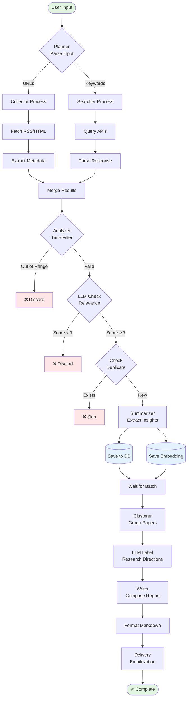
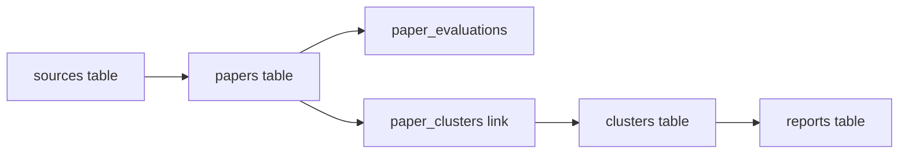
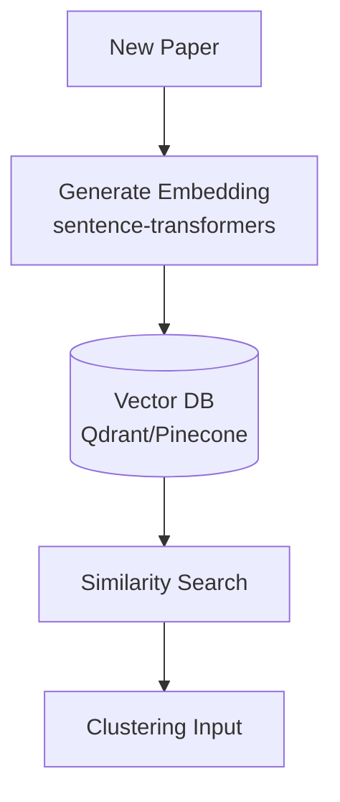

# Data Flow - Research Assistant Framework

## End-to-End Data Flow



## Detailed Flow Stages

### Stage 1: Input Processing
**Input**: Raw user input (List of strings)
**Process**:
1. Parse each item
2. Detect type (URL regex vs plain text)
3. Route to appropriate ingestion service

**Output**: 
```json
{
  "collector_queue": ["https://arxiv.org/rss/cs.AI", "..."],
  "searcher_queue": ["Network Intrusion Detection", "..."]
}
```

---

### Stage 2: Data Acquisition

#### Collector Branch
**Input**: URL list
**Process**:
1. Fetch content (HTTP GET)
2. Parse format:
   - RSS: Extract `<item>` nodes
   - HTML: Scrape meta tags
   - PDF: Download to temp storage
3. Extract fields: `title`, `authors`, `date`, `abstract`, `url`

**Output**:
```python
Paper(
    title="...",
    authors=["A", "B"],
    published_date="2026-01-15",
    abstract="...",
    url="...",
    source_type="rss"
)
```

#### Searcher Branch
**Input**: Keyword query
**Process**:
1. Build API query (ArXiv, Semantic Scholar)
2. Execute request with filters (date range)
3. Parse JSON response

**Output**: Same `Paper` objects

---

### Stage 3: Analysis & Filtering

**Input**: Stream of `Paper` objects

**Flow**:
```python
for paper in papers:
    # Filter 1: Time
    if not (time_a <= paper.date <= time_b):
        continue
    
    # Filter 2: Relevance
    score = llm.score_relevance(paper.abstract, user_topic)
    if score < 7:
        continue
    
    # Filter 3: Dedup
    fingerprint = hash(paper.title + paper.authors)
    if db.exists(fingerprint):
        continue
    
    # Enrich
    summary = llm.summarize(paper.abstract)
    paper.summary = summary
    
    # Save
    db.save(paper)
    vector_db.save(paper.embedding)
```

**Output**: Enriched papers in database

---

### Stage 4: Clustering

**Input**: List of papers from DB (with embeddings)

**Process**:
1. Retrieve embeddings from Vector DB
2. Run clustering algorithm (HDBSCAN)
   ```python
   clusters = HDBSCAN(min_cluster_size=3).fit(embeddings)
   ```
3. For each cluster:
   - Collect paper summaries
   - Send to LLM: "What is the common research direction?"
   - Generate cluster name and description

**Output**:
```python
[
    Cluster(
        id=1,
        name="LLM for Network Security",
        paper_ids=[101, 102, 105],
        description="..."
    ),
    Cluster(id=2, name="Graph Neural Networks", ...)
]
```

---

### Stage 5: Report Generation

**Input**: Clusters + Papers

**Process**:
1. Load template
2. For each cluster:
   - Write section header
   - Write cluster summary
   - List papers with citations
3. Add metadata (date range, total count)

**Output**: Markdown report

**Example**:
```markdown
# Research Update - Network Intrusion Detection
**Period**: 2026-01-01 to 2026-02-01
**Total Papers**: 23

## Direction 1: LLM for Log Analysis (5 papers)
Recent works focus on fine-tuning LLMs...
- [Paper A](url)
- [Paper B](url)

## Direction 2: ...
```

---

### Stage 6: Delivery

**Input**: Final report (Markdown)

**Process**:
- Email: Convert MD to HTML, send via SMTP
- Notion: Convert to Notion blocks API
- Slack: Format as Slack message blocks

**Output**: Delivered notification

## Data Persistence

### Database Tables Flow



### Vector Store Flow


