# System Design - Research Assistant Framework

## Overview
The **Research Assistant** is a modular, microservices-oriented framework designed to automate the monitoring, analysis, and synthesis of scientific research documents.

## Architecture Diagram


## Component Details

### 1. Planner Service
**Role**: Input analysis and routing
- **Input**: User input (string or list)
- **Logic**: 
  - Detect URL pattern → Route to Collector
  - Detect Keywords → Route to Searcher
- **Output**: Routing decision

### 2. Ingestion Engine

#### Collector
**Role**: Collection from direct sources
- RSS Feed parsing
- Web crawling (HTML extraction)
- PDF download (if available)

#### Searcher
**Role**: Search via API
- ArXiv API integration
- Semantic Scholar API
- PubMed API (optional)

### 3. Analyzer Service
**Role**: Filtering and evaluation
- **Time Filter**: Discard papers outside range [A, B]
- **Relevance Check**: LLM scoring (0-10)
- **Deduplication**: Check fingerprint in DB

### 4. Summarizer Service
**Role**: Create structured summary
- **Input**: Abstract or Full Text
- **Process**: LLM extraction
  ```
  Problem: Research Problem
  Method: Proposed Approach
  Result: Key Results
  ```
- **Output**: Structured JSON summary

### 5. Cluster Service
**Role**: Group research directions
- Embedding generation (sentence-transformers)
- Clustering algorithm (HDBSCAN / KMeans)
- LLM labeling (name the direction)

### 6. Writer Service
**Role**: Create report
- Template-based report generation
- Markdown formatting
- Citation management

## Deployment Architecture

```mermaid
graph LR
    subgraph Docker["🐳 Docker Compose"]
        API[FastAPI<br/>Main App]
        Worker[Celery Worker<br/>Async Tasks]
        DB[(PostgreSQL)]
        Redis[(Redis<br/>Task Queue)]
        VDB[(Qdrant<br/>Vector DB)]
    end
    
    API --> Redis
    Worker --> Redis
    Worker --> DB
    Worker --> VDB
    API --> DB
    
    External[External APIs<br/>ArXiv/Semantic Scholar] --> Worker
```



## Scaling Considerations

### Phase 1 (MVP)
- Single Docker Compose setup
- Synchronous processing
- SQLite/PostgreSQL local

### Phase 2 (Production)
- Kubernetes deployment
- Async workers (Celery/RQ)
- Cloud DB (Supabase/AWS RDS)
- Vector DB (Pinecone/Qdrant Cloud)
