# Frontend Design - Research Assistant Framework

## Overview
The Frontend is the primary interaction interface for Researchers, built as a modern **Single Page Application (SPA)**, completely decoupled from the Backend API. The design focuses on **Readability** and efficient scientific information management.

## Tech Stack
- **Framework**: Next.js 14+ (App Router)
- **State Management**: React Query (TanStack Query) - *Optimized for server state sync*.
- **Styling**: **Vanilla CSS (CSS Modules)**.
  - Rules: No TailwindCSS.
  - Use CSS Variables for Theming (Dark/Light mode).
  - Modularize styles per Component (`*.module.css`).
- **Icons**: Lucide React.
- **Charts**: Recharts (statistical charts).

## Architecture Diagram

```mermaid
graph TD
    User[👤 Researcher] -->|HTTPS| CDN[CDN / Edge]
    CDN -->|Serve Static| FE[Next.js Client]
    
    subgraph Frontend Logic
        Page[Pages / Views] --> Components[UI Components]
        Components --> Hooks[Custom Hooks]
        Hooks --> Services[API Services]
        Services -->|Axios/Fetch| Backend[Backend API]
    end
    
    style FE fill:#FFD966
    style Backend fill:#DAE8FC
```



## UI/UX Modules

### 1. Dashboard (Home)
- **Overview Stats**: Number of new papers this week, papers read, trending topics.
- **Micro-interactions**: Hover over paper card for quick summary.
- **Aesthetics**: Glassmorphism for cards, subtle gradient backgrounds.

### 2. Source Manager (`/sources`)
- **Interface**: Table/Grid view to manage sources.
- **Actions**: 
  - Add Source (Link/Keyword input form).
  - Toggle Active/Inactive.
  - Edit Schedule.
- **Validation**: Real-time validation for RSS URLs.

### 3. Researcher Workspace (`/papers`)
- **Layout**: 2-Column (List on left, Detail on right) or Masonry Grid.
- **Features**:
  - Filter bar (Date, Relevance Score, Topic).
  - Search bar (Full-text search).
  - "Save to Collection" button.

### 4. Report Viewer (`/reports`)
- **Interface**: Document Reader (like Notion/Medium).
- **Typography**: Use modern serif fonts for report content (e.g., *Merriweather* or *Lora*) to optimize deep reading experience.
- **Export**: Download Markdown/PDF button.

## Component Design (Modular CSS)

Directory structure following Modular approach:
```
src/
  components/
    Button/
      index.tsx
      styles.module.css  <-- Vanilla CSS scope local
    Card/
      index.tsx
      styles.module.css
  app/
    dashboard/
      page.tsx
      page.module.css
```

**Example `styles.module.css`**:
```css
/* Use globally defined CSS Variables */
.card {
  background: var(--surface-color);
  border: 1px solid var(--border-color);
  border-radius: 12px;
  padding: 1.5rem;
  transition: transform 0.2s ease, box-shadow 0.2s ease;
}

.card:hover {
  transform: translateY(-2px);
  box-shadow: var(--shadow-md);
}
```

## API Integration

Use **Repository Pattern** in frontend to decouple API calls:

```typescript
// services/papers.ts
export const getPapers = async (filters: PaperFilter): Promise<Paper[]> => {
  const params = new URLSearchParams(filters);
  const res = await fetch(`/api/v1/papers?${params}`);
  return res.json();
};

// hooks/usePapers.ts
export const usePapers = (filters: PaperFilter) => {
  return useQuery({
    queryKey: ['papers', filters],
    queryFn: () => getPapers(filters)
  });
};
```

## Deployment Frontend
The Frontend will be packaged as a separate Docker Image, communicating with Backend via Internal Network or Public API Gateway.

```dockerfile
# Dockerfile UI
FROM node:20-alpine AS builder
WORKDIR /app
COPY package.json .
RUN npm install
COPY . .
RUN npm run build

FROM node:20-alpine AS runner
WORKDIR /app
COPY --from=builder /app/.next ./.next
COPY --from=builder /app/public ./public
CMD ["npm", "start"]
```
