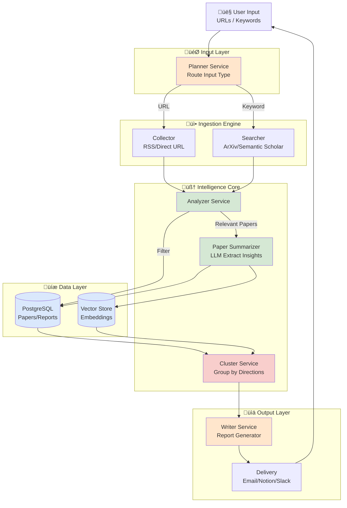
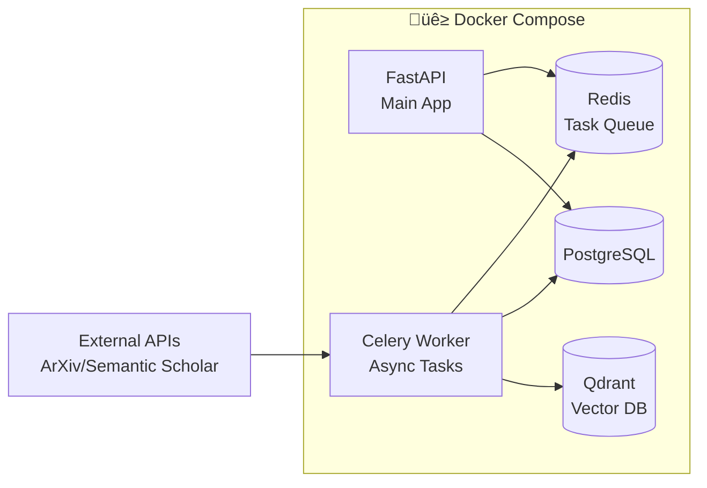

# System Design - Research Assistant Framework

## Overview
Hệ thống **Research Assistant** là một framework modular, microservices-oriented để tự động hóa việc theo dõi, phân tích và tổng hợp tài liệu nghiên cứu khoa học.

## Architecture Diagram


```mermaid
graph TB
    User[👤 User Input<br/>URLs / Keywords]
    
    subgraph Frontend["🎯 Input Layer"]
        Planner[Planner Service<br/>Route Input Type]
    end
    
    subgraph Ingestion["üì• Ingestion Engine"]
        Collector[Collector<br/>RSS/Direct URL]
        Searcher[Searcher<br/>ArXiv/Semantic Scholar]
    end
    
    subgraph Processing["🧠 Intelligence Core"]
        Analyzer[Analyzer Service]
        Summarizer[Paper Summarizer<br/>LLM Extract Insights]
        Clusterer[Cluster Service<br/>Group by Directions]
    end
    
    subgraph Storage["üíæ Data Layer"]
        DB[(PostgreSQL<br/>Papers/Reports)]
        VectorDB[(Vector Store<br/>Embeddings)]
    end
    
    subgraph Output["üìä Output Layer"]
        Writer[Writer Service<br/>Report Generator]
        Delivery[Delivery<br/>Email/Notion/Slack]
    end
    
    User --> Planner
    Planner -->|URL| Collector
    Planner -->|Keyword| Searcher
    
    Collector --> Analyzer
    Searcher --> Analyzer
    
    Analyzer -->|Filter| DB
    Analyzer -->|Relevant Papers| Summarizer
    Summarizer --> DB
    Summarizer --> VectorDB
    
    DB --> Clusterer
    VectorDB --> Clusterer
    
    Clusterer --> Writer
    Writer --> Delivery
    Delivery --> User
    
    style Planner fill:#FFE6CC
    style Analyzer fill:#D5E8D4
    style Summarizer fill:#D5E8D4
    style Clusterer fill:#F8CECC
    style Writer fill:#FFE6CC
    style DB fill:#DAE8FC
    style VectorDB fill:#DAE8FC
```

## Component Details

### 1. Planner Service
**Nhiệm vụ**: Phân tích input và routing
- **Input**: User input (string ho·∫∑c list)
- **Logic**: 
  - Phát hiện URL pattern → Route to Collector
  - Phát hiện Keywords → Route to Searcher
- **Output**: Routing decision

### 2. Ingestion Engine

#### Collector
**Nhiệm vụ**: Thu thập từ nguồn trực tiếp
- RSS Feed parsing
- Web crawling (HTML extraction)
- PDF download (nếu có)

#### Searcher
**Nhiệm vụ**: Tìm kiếm qua API
- ArXiv API integration
- Semantic Scholar API
- PubMed API (optional)

### 3. Analyzer Service
**Nhiệm vụ**: Lọc và đánh giá
- **Time Filter**: Loại bỏ papers ngoài khoảng [A, B]
- **Relevance Check**: LLM scoring (0-10)
- **Deduplication**: Check fingerprint trong DB

### 4. Summarizer Service
**Nhiệm vụ**: Tạo structured summary
- **Input**: Abstract ho·∫∑c Full Text
- **Process**: LLM extraction
  ```
  Problem: Vấn đề nghiên cứu
  Method: Phương pháp đề xuất
  Result: Kết quả chính
  ```
- **Output**: Structured JSON summary

### 5. Cluster Service
**Nhiệm vụ**: Phân nhóm research directions
- Embedding generation (sentence-transformers)
- Clustering algorithm (HDBSCAN / KMeans)
- LLM labeling (đặt tên hướng)

### 6. Writer Service
**Nhiệm vụ**: Tạo báo cáo
- Template-based report generation
- Markdown formatting
- Citation management

## Deployment Architecture


```mermaid
graph LR
    subgraph Docker["üê≥ Docker Compose"]
        API[FastAPI<br/>Main App]
        Worker[Celery Worker<br/>Async Tasks]
        DB[(PostgreSQL)]
        Redis[(Redis<br/>Task Queue)]
        VDB[(Qdrant<br/>Vector DB)]
    end
    
    API --> Redis
    Worker --> Redis
    Worker --> DB
    Worker --> VDB
    API --> DB
    
    External[External APIs<br/>ArXiv/Semantic Scholar] --> Worker
```

## Scaling Considerations

### Phase 1 (MVP)
- Single Docker Compose setup
- Synchronous processing
- SQLite/PostgreSQL local

### Phase 2 (Production)
- Kubernetes deployment
- Async workers (Celery/RQ)
- Cloud DB (Supabase/AWS RDS)
- Vector DB (Pinecone/Qdrant Cloud)
